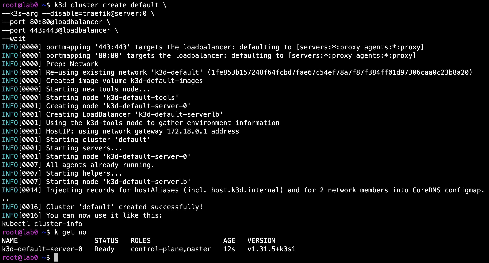
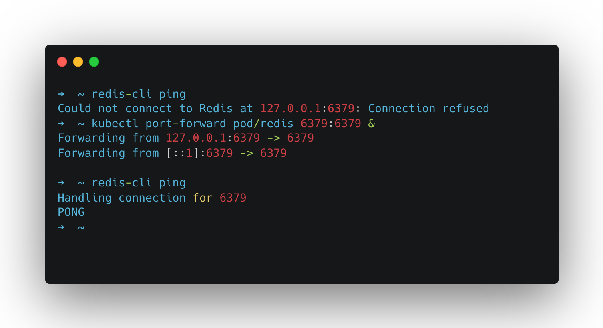
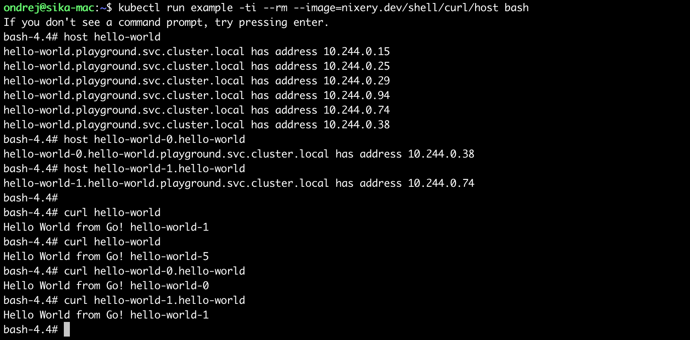
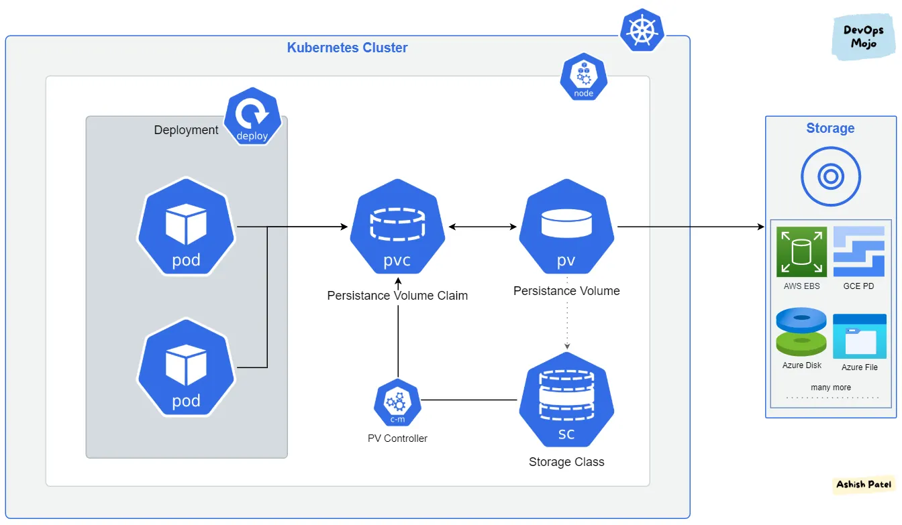
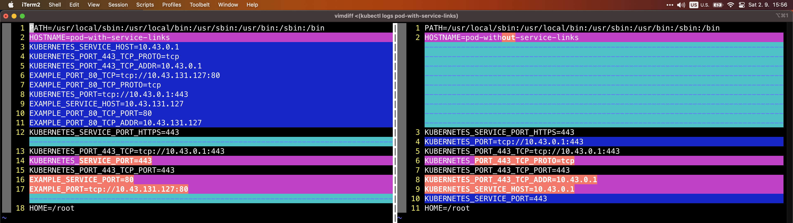

[Ondrej Sika (sika.io)](https://sika.io) | <ondrej@sika.io> | [go to course ->](#course) | [install kubernetes ->](#install-kubernetes) | [join slack](https://sika.link/slack-sikapublic), [open slack](https://sikapublic.slack.com) | [join.sika.io](https://join.sika.io)


# Kubernetes Training

    Ondrej Sika <ondrej@ondrejsika.com>
    https://github.com/ondrejsika/kubernetes-training

Source of my Kubernetes Training.

## About Course

- [Kubernetes training in Czech Republic](https://ondrej-sika.cz/skoleni/kubernetes?_s=gh-kte)
- [Kubernetes training in Europe](https://ondrej-sika.com/training/kubernetes?_s=gh-kte)

<!--
### Related Courses
-->

### Chat

For sharing links & "secrets".

- Zoom Chat
- Slack - https://sikapublic.slack.com/
- Microsoft Teams
- https://sika.link/chat (tlk.io)

## About Me - [Ondrej Sika](https://sika.io)

**Freelance DevOps Engineer, Consultant & Lecturer**

- Complete DevOps Pipeline
- Open Source / Linux Stack
- Cloud & On-Premise
- Technologies: Git, Gitlab, Gitlab CI, Docker, Kubernetes, Terraform, Prometheus, ELK / EFK, Rancher, Proxmox, DigitalOcean, AWS

### Related Courses

- ArgoCD - [Skoleni ArgoCD](https://ondrej-sika.cz/skoleni/argocd)
- Prometheus (Monitoring & Alerting) - [Skoleni Prometheus](https://ondrej-sika.cz/skoleni/prometheus)
- Loki (Log Management) - [Skoleni Loki](https://ondrej-sika.cz/skoleni/loki)

## Introduction to Kubernetes

### What is Kubernetes

- **Platform for running (containerized) applications**

### What does Kubernetes do?

- Abstract away the underlying infrastructure - one large pool of resources
- Deploy your desired state
- Minimize manual tasks & toil
- Auto Scaling & High Availability
- Service Discovery
- Plug-in based architecture (network, storage, monitoring)
- Native support for many cloud native tools (monitoring, logging, …)

### No vendor lock

Kubernetes is no vendor locked to specific provider, you can run Kubernetes on various platforms

In cloud:

- Big 3
  - Azure
  - AWS
  - GCP
- Smaller cloud providers
  - DigitalOcean
  - Hetzner Cloud
- Local cloud / hosting providers
  - CRA.cz
  - VSHosting.cz

On-premise:

- Upstream Kubernetes (vanilla, kubeadm)
- Rancher (rke2, k3s)
- OpenShift
- VMware Tanzu

### Cluster Architecture

[](https://raw.githubusercontent.com/ondrejsika/kubernetes-training/refs/heads/master/_images/kubernetes_cluster_architecture.svg)

[old image of architecture](./_images/kubernetes_components.png)

### Kubernetes Cluster Components

- **API Server** - Stateless API server backed by distributed Etcd
- **Controller Manager** - ensure the actual state of the cluster equals the desired state
- **Scheduler** - Binds an unbound Pod to a Node
- **Kubelet** - Client for API Server, run Pods
- **Kube Proxy** - Forward traffic into cluster

### Tools

- **kubectl** - Kubernetes client
- **helm** - Package manager
- **k9s** - CLI Dashboard
- **k3d** - run [k3s](https://k3s.io) Kubernetes locally in Docker (we will use this for the training)
- **minikube** - Run Kubernetes locally (we don't use this for the training)

## 12 Factor Apps

[12factor.net](https://12factor.net)

Set of 12 rules how to write modern applications.

### Any Questions?

Write me mail to <ondrej@sika.io>

## Install Kubernetes

Checkout install instructions here

- <https://ondrej-sika.cz/navody/lokalni-instalace-kubernetes/> (in Czech)

### Start k3d Kubernetes Cluster

```
k3d cluster create default \
  --k3s-arg --disable=traefik@server:0 \
  --servers 1 \
  --port 80:80@loadbalancer \
  --port 443:443@loadbalancer \
  --wait
```



### Switch to training namespace

Create namespace `training`

```
kubectl create ns training
```

Switch to namespace `training`

```
kubectl config set-context --current --namespace training
```

or using `kubens`

```
kubens training
```

or with `kn` alias of `kubens`

```
kn training
```

## Course

### Explain Kubernetes Resources

```
kubectl explain node
kubectl explain node.spec
kubectl explain node.status.images

kubectl explain pod
kubectl explain pod.spec
kubectl explain pod.spec.containers.image
```

### Get Nodes

```
kubectl get nodes
```

```
kubectl get node
```

```
kubectl get no
```

```
kubectl get no k3d-default-server-0
```

```
kubectl get no/k3d-default-server-0
```

```
kubectl get no k3d-default-server-0 -o yaml
```

```
kubectl get no k3d-default-server-0 -o json
```

```
kubectl get no k3d-default-server-0 -o jsonpath="{.status.addresses[0].address }{'\n'}"
```

```
kubectl get no -o jsonpath="{range .items[*]}{.status.addresses[0].address} {.status.addresses[1].address}{'\n'}{end}"
```

### Dashboard

### K9s - CLI Dashboard

- https://k9scli.io/
- https://github.com/derailed/k9s

### Headlamp

- https://headlamp.dev
- https://github.com/kubernetes-sigs/headlamp
- https://headlamp.dev/docs/latest/installation/in-cluster/#using-helm

#### Install Headlamp on DigitalOcean (k8s.sikademo.com)

```
helm upgrade --install \
  headlamp \
  --repo https://kubernetes-sigs.github.io/headlamp/ \
  headlamp \
  --namespace kube-system \
  --values examples/helm/values/headlamp.values.yaml
```

Create token for Headlamp

```
kubectl create token headlamp --namespace kube-system
```

Go to Headlamp: <https://headlamp.k8s.sikademo.com>

#### Install Headlamp on lab0 (local k3d cluster, lab0.sikademo.com)

```
helm upgrade --install \
  headlamp \
  --repo https://kubernetes-sigs.github.io/headlamp/ \
  headlamp \
  --namespace kube-system
```

Create token for Headlamp

```
kubectl create token headlamp --namespace kube-system
```

Run port-forward

```
kubectl port-forward -n kube-system svc/headlamp 4466:80 --address 0.0.0.0
```

Go to Headlamp: <http://lab0.sikademo.com:4466>

### VS Code Kubernetes Plugin

- https://marketplace.visualstudio.com/items?itemName=ms-kubernetes-tools.vscode-kubernetes-tools

### Kubectl Cheat Sheets

- https://kubernetes.io/docs/reference/kubectl/quick-reference/

### Create Pod

```
kubectl apply -f 01_pod.yml
kubectl apply -f 02_pod.yml
kubectl apply -f pod_php.yaml
kubectl apply -f pod_redis.yml
```

### Validate YAML using kubectl

```
kubectl apply --dry-run=server -f pod_invalid_yaml.yml
```

### List Pods

```
kubectl get pods
kubectl get pod
kubectl get po
```

```
kubectl get po redis
```

```
kubectl get po/redis
```

```
kubectl get -f pod_redis.yml
```

```
kubectl get po redis simple-hello-world
```

```
kubectl get po/redis po/simple-hello-world
```

```
kubectl get po/redis no/k3d-default-server-0
```

```
kubectl get -f pod_redis.yml -f 01_pod.yml
```

```
kubectl get pods -o json
```

```
kubectl get po -o jsonpath="{range .items[*]}{.spec.containers[0].image}{'\n'}{end}"
```

```
kubectl get po -o custom-columns="name:{.metadata.name},namespace:{.metadata.namespace},ip:{.status.podIP}"
```

### Port Forward

```
kubectl port-forward simple-hello-world 8000:80
```

```
kubectl port-forward pod/simple-hello-world 8000:80
```

See: <http://127.0.0.1:8000>

Port forward on all interfaces (remote host):

```
kubectl port-forward simple-hello-world 8000:80 --address 0.0.0.0
```

Redis port forward example

```
kubectl port-forward redis 6379:6379
```

Test with local `redis-cli` (if you have):

```
redis-cli ping
```



### Proxy to cluster

Start proxy

```
kubectl proxy
```

Change port

```
kubectl proxy -p 8002
```

**DO NOT RUN IN PRODODUCTION**: Run proxy on all interfaces and allow all hosts - for training only

```
kubectl proxy --address 0.0.0.0 --accept-hosts=".*"
```

On lab VM, you can also run proxy in Docker:

```
docker run -d --name proxy --net host -v /root:/root sikalabs/kubectl kubectl proxy --address 0.0.0.0 --accept-hosts=".*"
```

### See Pods using kubectl proxy

See:

- http://127.0.0.1:8001/api/v1/namespaces/training/pods/simple-hello-world/proxy/
- http://127.0.0.1:8001/api/v1/namespaces/training/pods/multi-container-pod/proxy/

### Get from file

Get pods from file

```
kubectl get -f 01_pod.yml
kubectl get -f 02_pod.yml
```

### Describe Pod

See informations & events in pretty output

```
kubectl describe -f 01_pod.yml
kubectl describe -f 02_pod.yml
```

### Exec (Connect) Pod

```
kubectl exec redis -- redis-cli ping
```

```
kubectl exec -ti redis -- redis-cli
```

Defaut container is first one in multi-container pod

```
kubectl exec multi-container-pod -- ls /usr/share/nginx/html
```

```
kubectl exec multi-container-pod -- ls /html
```

Connect specific container

```
kubectl exec multi-container-pod -c date -- ls /html
```

```
kubectl exec multi-container-pod -c date -- ls /usr/share/nginx/html
```

### Pod Logs

```
kubectl logs simple-hello-world
```

or following logs

```
kubectl logs simple-hello-world -f
```

Logs from multi container pod

```
kubectl logs multi-container-pod nginx
kubectl logs multi-container-pod date
```

From Kubernetes 1.24 you can see logs from first container by default

```
kubectl logs multi-container-pod
```

### Assigning Pods to Nodes

Docs - <https://kubernetes.io/docs/concepts/configuration/assign-pod-node/>

### Select by node name (nodeName)

```
kubectl apply -f nodename.yml
```

#### See node labels

```
kubectl get nodes --show-labels
```

#### Create new labels

You can create own labels

```
kubectl label nodes <node-name> <label-key>=<label-value>
```

Example

```
kubectl label nodes k3d-default-server-0 foo=bar
```

### Select by label (nodeSelector)

```
kubectl apply -f nodeselector.yml
```

### Affinity

<https://kubernetes.io/docs/concepts/configuration/assign-pod-node/#affinity-and-anti-affinity>

#### requiredDuringSchedulingIgnoredDuringExecution

```
kubectl apply -f affinity_required.yml
```

#### preferredDuringSchedulingIgnoredDuringExecution

```
kubectl apply -f affinity_preferred.yml
```

### Delete Pod

```
kubectl delete -f 01_pod.yml -f 02_pod.yml

# or
kubectl delete po/simple-hello-world
kubectl delete po/multi-container-pod
```

### Delete All Pods

```
kubectl delete po --all
```

### Private Container Registry

Deploy private pod

```
kubectl apply -f private_pod.yml
```

See <http://127.0.0.1:8001/api/v1/namespaces/training/pods/private-pod/proxy/>

See credentials (of example `registry.sikalabs.com`)

```
kubectl get secret private-registry-credentials -o jsonpath="{.data.\.dockerconfigjson}" | base64 --decode | jq '.auths["registry.sikalabs.com"].auth' -r | base64 --decode && echo
```

Cleanup

```
kubectl delete -f private_pod.yml
```

### Service

Create service which point to your ReplicaSets, Deployments and DaemonSets.

We will talk about services later.

```
kubectl apply -f service.yml
```

See proxy to service: <http://127.0.0.1:8001/api/v1/namespaces/training/services/example/proxy/>

Try apply pods:

```
kubectl apply -f 01_pod.yml -f 02_pod.yml -f private_pod.yml -f pod_redis.yml -f pod_php.yaml
```

Get pods for this service

```
kubectl get po -l svc=example
```

Check service proxt again. <http://127.0.0.1:8001/api/v1/namespaces/training/services/example/proxy/>

Delete pods

```
kubectl delete -f 01_pod.yml -f 02_pod.yml -f private_pod.yml -f pod_redis.yml -f pod_php.yaml
```

### Create Replica Set

```
kubectl apply -f 03_replica_set.yml
```

### List Replica Sets

```
kubectl get replicasets
```

```
kubectl get rs
```

```
kubectl get rs,po
```

See pods in service proxy: <http://127.0.0.1:8001/api/v1/namespaces/training/services/example/proxy/>

### Delete Replica Set

```
kubectl delete -f 03_replica_set.yml
```

or

```
kubectl delete rs/my-replicaset
```

### Well-Known Labels, Annotations and Taints

<https://kubernetes.io/docs/reference/labels-annotations-taints/>

### Create Deployment

```
kubectl apply -f 04_deployment.yml
```

You can wait until Deployment (DaemonSet, StatefulSet) will be rolled out

```
kubectl rollout status deployment my-deployment
```

### List Deployments

```
kubectl get deployments
```

```
kubectl get deploy
```

```
kubectl get deploy,rs,po
```

See pods in service proxy: <http://127.0.0.1:8001/api/v1/namespaces/training/services/example/proxy/>

or using port forward:

```
kubectl port-forward deploy/my-deployment 8000:80
```

See: <http://127.0.0.1:8000>

### Update Deployment

Update deplyoyment image and apply again

```
kubectl apply -f 04_deployment.yml
```

Wait until deployment will be rolled out

```
kubectl rollout status deployment my-deployment
```

### Restart Deployment

```
kubectl rollout restart deploy my-deployment
```

### Clean up Policy

https://kubernetes.io/docs/concepts/workloads/controllers/deployment/#clean-up-policy

### Delete Deployment

```
kubectl delete -f 04_deployment.yml
```

or

```
kubectl delete deploy/my-deployment
```

## Deployment Strategies

Great resources by Container Solutions

- [article](https://container-solutions.com/kubernetes-deployment-strategies)
- [repository](https://github.com/ContainerSolutions/k8s-deployment-strategies)

### Rolling Update (without downtime)

Create deployment & service

```
kubectl apply -f strategy_rolling_update.yml
```

See update

```
vimdiff strategy_rolling_update.yml strategy_rolling_update_2.yml
```

Update without downtime

```
kubectl apply -f strategy_rolling_update_2.yml
```

Clean up

```
kubectl delete -f strategy_rolling_update.yml
```

### Recreate

Create deployment & service

```
kubectl apply -f strategy_recreate.yml
```

See update

```
vimdiff strategy_recreate.yml strategy_recreate_2.yml
```

Update with downtime

```
kubectl apply -f strategy_recreate_2.yml
```

Clean up

```
kubectl delete -f strategy_recreate.yml
```

## Pods Spread Configuration (topologySpreadConstraints)

Try topologySpreadConstraints configuration:

```
kubectl apply -f topology_spread_constraints.yml
```

See pod's distribution:

```
kubectl get po -l app=topology-spread-constraints -o wide
```

### Create StatefulSet

Up to Kubernetes version 1.24

```
kubectl apply -f statefulset24.yml
```

From Kubernetes version 1.25

```
kubectl apply -f statefulset25.yml
```

```
kubectl rollout status sts hello-world
```

### List StatefulSets

```
kubectl get sts
kubectl get sts,po
```

See pods in service proxy: <http://127.0.0.1:8001/api/v1/namespaces/training/services/hello-world-headless/proxy/>

### Headless Service

Service which expose pods on `<pod-name>.<svc-name>` (`<pod-name>.<svc-name>.<namespace>.svc.cluster.local`). Requires `spec.clusterIP: None`.

See service in Stateful Set.

Example:

```
kubectl run dev -ti --rm --image=ghcr.io/sikalabs/dev
```

And try (inside of Kubernetes):

```
host hello-world-headless
host hello-world-0.hello-world-headless
host hello-world-1.hello-world-headless

curl hello-world-headless
curl hello-world-headless
curl hello-world-0.hello-world-headless
curl hello-world-1.hello-world-headless
```



### Delete StatefulSet

```
kubectl delete -f statefulset.yml

# or
kubectl delete sts/hello-world
```

### Create DaemonSet

```
kubectl apply -f daemonset.yml
kubectl rollout status ds hello-world
```

### List DaemonSets

```
kubectl get ds
kubectl get ds,po
```

See pods in service proxy: <http://127.0.0.1:8001/api/v1/namespaces/training/services/example/proxy/>

### Delete DaemonSet

```
kubectl delete -f daemonset.yml

# or
kubectl delete ds/hello-world
```

### Create Job

- <https://kubernetes.io/docs/concepts/workloads/controllers/jobs-run-to-completion/>
- <https://eksworkshop.com/batch/jobs/>

Create job:

```
kubectl apply -f job.yml
```

Create parallel job:

```
kubectl apply -f parallel_jobs.yml
```

#### Wait for Job Completion

```
kubectl wait --for=condition=complete --timeout=600s job/pi
```

Wait for jsonpath

```
kubectl wait --for=jsonpath='{.status.phase}'=running tkc/example
```

#### Automatic Job Cleanup

You have to set `ttlSecondsAfterFinished` in job spec.

### Job With Generated Name

Create (not apply) job

```
kubectl create -f job-generate-name.yml
```

Delete all jobs

```
kubectl delete job --all
```

Example

```
ondrej@sika-mac-air:~$ kubectl create -f job-generate-name.yml
job.batch/hello-4hjd4 created
ondrej@sika-mac-air:~$ kubectl create -f job-generate-name.yml
job.batch/hello-nrr8r created
ondrej@sika-mac-air:~$ kubectl create -f job-generate-name.yml
job.batch/hello-h8mjd created
ondrej@sika-mac-air:~$ kubectl get job
NAME          COMPLETIONS   DURATION   AGE
hello-4hjd4   1/1           1s         5s
hello-h8mjd   1/1           2s         3s
hello-nrr8r   1/1           2s         4s
ondrej@sika-mac-air:~$ kubectl delete job --all
job.batch "hello-4hjd4" deleted
job.batch "hello-h8mjd" deleted
job.batch "hello-nrr8r" deleted
```

### Create Cron Job

- <https://kubernetes.io/docs/tasks/job/automated-tasks-with-cron-jobs/>
- <https://crontab.guru/>

```
kubectl apply -f cronjob.yml
```

Trigger cron job manually using `kubectl`

```
kubectl create job --from=cronjob/cronjob-daily cronjob-daily-$(date +%s)
```

In `k9s` use `t` as trigger job (from cronjob).

### Delete Jobs

```
kubectl delete -f job.yml -f parallel_jobs.yml -f cronjob.yml
```

### kubectl run

Create a pod from command line

```
kubectl run dev -it --rm --image=ghcr.io/sikalabs/dev
```

with custom command

```
kubectl run dev -it --rm --image=ghcr.io/sikalabs/dev -- bash
```

Images on Github

- [sikalabs/dev](https://github.com/sikalabs/sikalabs-container-images/tree/master/dev)
- [sikalabs/ci](https://github.com/sikalabs/sikalabs-container-images/tree/master/ci)

Cleanup is not necessary, because `--rm` parameter deletes deployment after container exits.

### Alias `kdev`

Run `sikalabs/dev`:

```
alias kdev='kubectl run "dev-$(date +%s)" --rm -ti --image=ghcr.io/sikalabs/dev -- zsh'
```

We have also `slu kdev` which does exactly the same.

### Create Service ClusterIP

Create deploymnet again:

```
kubectl apply -f deployment.yml
```

And create service:

```
kubectl apply -f 05_clusterip_service.yml
```

See:

- http://127.0.0.1:8001/api/v1/namespaces/training/services/hello-world-clusterip:80/proxy/
- http://127.0.0.1:8001/api/v1/namespaces/training/services/hello-world-clusterip:8080/proxy/metrics

### Create Service NodePort

```
kubectl apply -f 06_nodeport_service.yml
```

See: http://127.0.0.1:8001/api/v1/namespaces/training/services/hello-world-nodeport/proxy/

### Create LoadBalancer Service

```
kubectl apply -f loadbalancer.yml
```

Wait until get external IP address. Works only in public clouds (like Digital Ocean, AWS) NOT in k3d. You have to have a loadbalancer provider.

### MetalLB

- https://github.com/metallb/metallb
- https://metallb.universe.tf
- https://metallb.universe.tf/installation/

```
kubectl apply -f https://raw.githubusercontent.com/metallb/metallb/v0.14.9/config/manifests/metallb-native.yaml
```

Apply pool config:

```
kubectl apply -f metallb_pool.yml
```

### List Services

```
kubectl get services
kubectl get svc
kubectl get po,rs,deploy,svc
kubectl get all
```

### Delete Service

```
kubectl delete -f 05_clusterip_service.yml
kubectl delete -f 06_nodeport_service.yml
kubectl delete -f loadbalancer.yml

# or
kubectl delete svc/hello-world-nodeport
kubectl delete svc/hello-world-clusterip

# and deployment
kubectl delete deploy/hello-world
```

## Ingress

Ingress Controllers - <https://kubernetes.io/docs/concepts/services-networking/ingress-controllers/>

### Install Ingress Nginx on DigitalOcean and k3d (lab)

```
helm upgrade --install \
  ingress-nginx ingress-nginx \
  --repo https://kubernetes.github.io/ingress-nginx \
  --create-namespace \
  --namespace ingress-nginx \
  --set controller.service.type=ClusterIP \
  --set controller.ingressClassResource.default=true \
  --set controller.kind=DaemonSet \
  --set controller.hostPort.enabled=true \
  --set controller.metrics.enabled=true \
  --wait
```

Or using `slu`:

```
slu scripts kubernetes install-ingress
```

### Install Ingress Nginx on AKS (Azure)

```bash
LOADBALANCER_IP=...
```

```
helm upgrade --install \
  ingress-nginx ingress-nginx \
  --repo https://kubernetes.github.io/ingress-nginx \
  --create-namespace \
  --namespace ingress-nginx \
  --set controller.service.type=LoadBalancer \
  --set controller.ingressClassResource.default=true \
  --set controller.kind=DaemonSet \
  --set controller.hostPort.enabled=true \
  --set controller.metrics.enabled=true \
  --set controller.config.use-proxy-protocol=false \
  --set controller.service.loadBalancerIP=$LOADBALANCER_IP \
  --set controller.service.annotations."service\.beta\.kubernetes\.io/azure-load-balancer-health-probe-request-path"=/healthz \
  --wait
```

Or with random public IP

```
helm upgrade --install \
  ingress-nginx ingress-nginx \
  --repo https://kubernetes.github.io/ingress-nginx \
  --create-namespace \
  --namespace ingress-nginx \
  --set controller.service.type=LoadBalancer \
  --set controller.ingressClassResource.default=true \
  --set controller.kind=DaemonSet \
  --set controller.hostPort.enabled=true \
  --set controller.metrics.enabled=true \
  --set controller.config.use-proxy-protocol=false \
  --set controller.service.annotations."service\.beta\.kubernetes\.io/azure-load-balancer-health-probe-request-path"=/healthz \
  --wait
```

See [ArtifactHub](https://artifacthub.io/packages/helm/ingress-nginx/ingress-nginx?modal=values) or [values.yml](https://github.com/kubernetes/ingress-nginx/blob/main/charts/ingress-nginx/values.yaml) for more options.

### Create Ingress

### Webservers and Ingress

Create some services (& deploymnets)

```
kubectl apply -f webservers.yml
```

See:

- http://127.0.0.1:8001/api/v1/namespaces/training/services/nginx:http/proxy/
- http://127.0.0.1:8001/api/v1/namespaces/training/services/apache:http/proxy/
- http://127.0.0.1:8001/api/v1/namespaces/training/services/caddy:http/proxy/

Create Ingress on localhost (`*.127.0.0.1.nip.io`)

```
kubectl apply -f ingress_webservers_localhost.yml
```

See:

- http://nginx.127.0.0.1.nip.io
- http://apache.127.0.0.1.nip.io
- http://caddy.127.0.0.1.nip.io

Create Ingress on DigitalOcean

We need a [cert-managet](https://cert-manager.io/) for creating HTTPS certificates. You can install it using helm:

```
helm upgrade --install \
	cert-manager cert-manager \
	--repo https://charts.jetstack.io \
	--create-namespace \
	--namespace cert-manager \
	--set crds.enabled=true \
	--wait
```

Or using [slu](https://github.com/sikalabs/slu):

```
slu scripts kubernetes install-cert-manager
```

Install cluster issuer:

```
kubectl apply -f clusterissuer-letsencrypt.yml
```

or using `slu`:

```
slu scripts kubernetes install-cluster-issuer
```

Create Ingress on lab0 (`*.lab0.sikademo.com`) with Let's Encrypt certifikates

```
kubectl apply -f ingress_webservers_lab0.yml
```

Create Ingress on sikademo cluster (`*.k8s.sikademo.com`) with Let's Encrypt certifikates

```
kubectl apply -f ingress_webservers_k8s.yml
```

See:

- http://nginx.k8s.sikademo.com
- http://apache.k8s.sikademo.com

Cleanup

```
kubectl delete -f webservers.yml
kubectl delete -f ingress_webservers_localhost.yml
kubectl delete -f ingress_webservers_lab0.yml
kubectl delete -f ingress_webservers_k8s.yml
```

### Sticky Sessions

<https://kubernetes.github.io/ingress-nginx/examples/affinity/cookie/>

Localhost:

```
kubectl apply -f ingress_sticky_localhost.yml
```

DigitalOcean (`*.k8s.sikademo.com`):

```
kubectl apply -f ingress_sticky_k8s.yml
```

Lab0 (`*.lab0.sikademo.com`):

```
kubectl apply -f ingress_sticky_lab0.yml
```

### Deploy Application (Multiple Deployments and Services)

```
kubectl apply -f counter.yml
```

See: http://127.0.0.1:8001/api/v1/namespaces/training/services/counter/proxy/

### List components

```
kubectl get all -l project=counter
```

### Delete Application

```
kubectl delete -f counter.yml
```

## Startup & Liveness Probes

Docs: <https://kubernetes.io/docs/tasks/configure-pod-container/configure-liveness-readiness-probes/>

### `/livez` vs `/healthz`

Use `/livez` instead of `/healthz` (deprecated)

[source](https://www.jaktech.co.uk/java/difference-between-livez-readyz-and-healthz-in-kubernetes-cluster/)

### Startup Probe

```
kubectl apply -f probes_startup.yml
```

Watch pods:

```
watch -n 0.3 kubectl get deploy,rs,po -l app=startup
```

Watch service:

```
watch -n 0.3 kubectl describe svc startup
```

Watch output:

```
watch -n 0.3 curl -fsSL http://127.0.0.1:8001/api/v1/namespaces/training/services/startup/proxy/
```

or using slu watch

```
slu w -- curl -fsSL http://127.0.0.1:8001/api/v1/namespaces/training/services/startup/proxy/
```

Cleanup

```
kubectl delete -f probes_startup.yml
```

### Liveness Probe

```
kubectl apply -f probes_liveness.yml
```

Watch pods:

```
watch -n 0.3 kubectl get deploy,rs,po -l app=liveness
```

Watch output:

```
watch -n 0.3 curl -fsSL http://127.0.0.1:8001/api/v1/namespaces/training/services/liveness/proxy/
```

or using slu watch

```
slu w -- curl -fsSL http://127.0.0.1:8001/api/v1/namespaces/training/services/liveness/proxy/
```

Cleanup

```
kubectl delete -f probes_liveness.yml
```

### Readiness Probe

```
kubectl apply -f probes_readiness.yml
```

Watch pods:

```
watch -n 0.3 kubectl get deploy,rs,po -l app=readiness
```

Watch service:

```
watch -n 0.3 kubectl describe svc readiness
```

Watch output:

```
watch -n 0.3 curl -fsSL http://127.0.0.1:8001/api/v1/namespaces/training/services/readiness/proxy/
```

or using slu watch

```
slu w -- curl -fsSL http://127.0.0.1:8001/api/v1/namespaces/training/services/readiness/proxy/
```

Cleanup

```
kubectl delete -f probes_readiness.yml
```

## InitContainers

More about init containers here: <https://kubernetes.io/docs/concepts/workloads/pods/init-containers/>

See example [init_containers.yml](init_containers.yml)

See also diff with counter example

```
vimdiff counter.yml init_containers.yml
```

Example:

```
kubectl apply -f init_containers.yml

kubectl get -f init_containers.yml

kubectl delete -f init_containers.yml
```

See example of [ondrejsika/wait-for-it](https://github.com/ondrejsika/docker-training/tree/master/examples/wait-for-it)

#### Setup some env example using Init Containers

```
kubectl apply -f init_containers_setup.yml
```

#### Wait for Migrations in Init Container

Wait using `kubectl`

```
kubectl apply -f init_containers_migrations.yml
```

Wait using `slu`

```
kubectl apply -f init_containers_migrations_slu.yml
```

### Create Namespace

```
kubectl create namespace counter
```

or

```
kubectl apply -f 08_namespace.yml
```

### List Namespaces

```
kubectl get namespaces
kubectl get ns
```

### Get Resources from All Namespaces

Try

```
kubectl get pods

# and

kubectl get pods -A
kubectl get pods --all-namespaces
```

### Deploy to Namespace

```
kubectl apply -f counter.yml -n counter
```

See: http://127.0.0.1:8001/api/v1/namespaces/counter/services/counter/proxy/

### Deploy to Namespace using metadata.namespace

```
kubectl apply -f deployment_in_namespace.yml
```

### Switch Namespace in Current Context

```
kubectl config set-context --current --namespace=counter
```

### kubens

I prefer alias `kn` over original command `kubens`.

List namespaces

```
kn
```

or

```
kubens
```

Switch namespace

```
kn counter
```

or

```
kubens counter
```

### Delete Namespace

```
kubectl delete -f 08_namespace.yml

# or
kubectl delete ns/counter
```

### Delete Terminating Namespace

- https://www.ibm.com/docs/en/cloud-private/3.2.x?topic=console-namespace-is-stuck-in-terminating-state

```
kubectl patch ns <Namespace_to_delete> -p '{"metadata":{"finalizers":null}}'
```

or using `slu`

```
slu k8s delete-ns -n name_of_the_namespac
```

### Resource Quotas

Create Resource Quotas

```
kubectl apply -f resourcequota.yml
```

See Resource Quotas:

```
kubectl describe resourcequotas
```

Try to deploy:

```
kubectl apply -f statefulset.yml
kubectl apply -f service.yml
kubectl apply -f 01_pod.yml
```

## Storage & Volumes



Image source: <https://medium.com/devops-mojo/kubernetes-storage-options-overview-persistent-volumes-pv-claims-pvc-and-storageclass-sc-k8s-storage-df71ca0fccc3>

## StorageClass, PersistentVolumeClaim, PersistentVolume

- **StorageClass** - provides a way to select storage types. For example azure-disk (fast, expensive block storage) and azure-file (slower, cheap storage).
- **PersistentVolumeClaim (PVC)** - a request for storage used by pods.
- **PersistentVolume (PV)** - a piece of storage in the cluster that has been dynamically provisioned using Storage Classes or statically created by an administrator.

### StorageClass

Docs: <https://kubernetes.io/docs/concepts/storage/storage-classes/>

List Storage Classes:

```
kubectl get storageclass
```

or

```
kubectl get sc
```

### Access Modes

Docs: <https://kubernetes.io/docs/concepts/storage/persistent-volumes/#access-modes>

**ReadWriteOnce**

the volume can be mounted as read-write by a single node. ReadWriteOnce access mode still can allow multiple pods to access (read from or write to) that volume when the pods are running on the same node. For single pod access, please see ReadWriteOncePod.

Used mostly for databases on block storage (azure-disk, ...).

**ReadWriteMany**

the volume can be mounted as read-write by many nodes.

Mostly used in applications which need shared storage (like web servers) on file storage (azure-file, NFS, ...).

#### Other (not so popular) Access Modes:

**ReadOnlyMany**

the volume can be mounted as read-only by many nodes.

**ReadWriteOncePod**

the volume can be mounted as read-write by a single Pod. Use ReadWriteOncePod access mode if you want to ensure that only one pod across the whole cluster can read that PVC or write to it.

### PersistentVolumeClaim

From default **StorageClass**

```
kubectl apply -f pvc_default.yml
```

See PV and PVC

```
kubectl get pv,pvc
```

Use PVC

```
kubectl apply -f pvc_mount_example.yml
```

See: <http://127.0.0.1:8001/api/v1/namespaces/training/services/pvc-mount-example/proxy/>

Example of `kubectl cp`:

```
kubectl cp index.html <pod>:usr/share/nginx/html/index.html
kubectl cp <pod>:usr/share/nginx/html/index.html index.html
```

Clean up

```
kubectl delete -f pv_nfs.yml -f pvc_nfs.yml -f pvc_mount_example.yml
```

### Longhorn

<https://longhorn.io/>

Install

```
kubectl apply -f https://raw.githubusercontent.com/longhorn/longhorn/v1.8.1/deploy/longhorn.yaml
```

#### Longhorn Dashboard

See <http://127.0.0.1:8001/api/v1/namespaces/longhorn-system/services/longhorn-frontend:80/proxy/>

#### Make Longhorn Default Storage Class

Clean is default from `do-block-storage` (DigitalOcean), `local-path` in k3d and `standard` (Minikube).

```
kubectl patch storageclass do-block-storage -p '{"metadata": {"annotations":{"storageclass.kubernetes.io/is-default-class":"false"}}}'
kubectl patch storageclass local-path -p '{"metadata": {"annotations":{"storageclass.kubernetes.io/is-default-class":"false"}}}'
kubectl patch storageclass standard -p '{"metadata": {"annotations":{"storageclass.kubernetes.io/is-default-class":"false"}}}'
```

Set Longhorn as default

```
kubectl patch storageclass longhorn -p '{"metadata": {"annotations":{"storageclass.kubernetes.io/is-default-class":"true"}}}'
```

### NFS Client Provisioner

Setup Helm:

```
helm repo add nfs-subdir-external-provisioner https://kubernetes-sigs.github.io/nfs-subdir-external-provisioner/
helm repo update
```

Install using Helm:

```
helm install nfs-subdir-external-provisioner nfs-subdir-external-provisioner/nfs-subdir-external-provisioner --namespace nfs-subdir-external-provisioner --create-namespace --set nfs.server=<nfs-server> --set nfs.path=<exported-path>
```

Example with my NFS server (nfs.sikademo.com):

```
helm install nfs-subdir-external-provisioner nfs-subdir-external-provisioner/nfs-subdir-external-provisioner --namespace nfs-subdir-external-provisioner --create-namespace --set nfs.server=nfs.sikademo.com --set nfs.path=/nfs
```

You can use `nfs-client` Storage Class:

```
kubectl apply -f pvc_nfs_client.yml
```

Mount example:

```
kubectl apply -f nfs-client-deployment.yml
```

See: <http://127.0.0.1:8001/api/v1/namespaces/training/services/example/proxy/>

### Direct NFS Volume mount

```
kubectl apply -f nfs-volume-example.yml
```

See: <http://127.0.0.1:8001/api/v1/namespaces/training/pods/nfs-volume-example:80/proxy/>

### Reclaim Policy Retain

#### Install Storage Classes with Reclaim Policy Retain

Minikube

```
kubectl apply -f sc-minikube-retain.yml
```

AWS GP2

```
kubectl apply -f sc-gp2-retain.yml
```

DigitalOcean

```
kubectl apply -f sc-do-retain.yml
```

Longhorn

```
kubectl apply -f sc-longhorn-retain.yml
```

#### Apply PVC with Storage Class

Minikube

```
kubectl apply -f pvc-minikube-retain.yml
```

DigitalOcean

```
kubectl apply -f pvc-do-retain.yml
```

Longhorn

```
kubectl apply -f pvc-longhorn-retain.yml
```

### CephFS Example

```
kubectl apply -f cephfs-volume-example.yml
```

See: <http://127.0.0.1:8001/api/v1/namespaces/training/pods/cephfs-volume-example/proxy/>

## ConfigMaps & Secrets

- **ConfigMaps** - for non-sensitive configuration data.
- **Secrets** - for sensitive data (passwords, tokens, keys).

### Create secret

```
kubectl apply -f 11_secret.yml
```

### Create TLS secret from cert and key

Create secret file `tls_secret_127-0-0-1.uk.local.yaml`

```
kubectl create secret tls sikademo.com-tls \
  --key=sikademo.com.key \
  --cert=sikademo.com.crt \
  --dry-run=client -o yaml | tee secret_tls_sikademo_com.local.yml
```

Create secret in Kubernetes cluster

```
kubectl create secret tls sikademo.com-tls \
  --key=sikademo.com.key \
  --cert=sikademo.com.crt
```

### Get Values

Base64 encoded

```
kubectl get secret my-secret -o go-template='{{.data.password}}{{"\n"}}'
kubectl get secret my-secret -o go-template='{{.data.token}}{{"\n"}}'
```

```
kubectl get secret my-secret -o jsonpath="{.data.password}" && echo
kubectl get secret my-secret -o jsonpath="{.data.token}" && echo
```

Decoded

```
kubectl get secret my-secret -o go-template='{{.data.password|base64decode}}{{"\n"}}'
kubectl get secret my-secret -o go-template='{{.data.token|base64decode}}{{"\n"}}'
```

```
kubectl get secret my-secret -o jsonpath="{.data.password}" | base64 --decode && echo
kubectl get secret my-secret -o jsonpath="{.data.token}" | base64 --decode && echo
```

### Create ConfigMap

```
kubectl apply -f 12_config_map.yml
```

### Example usage

```
kubectl apply -f 13_secret_example.yml
```

See <http://127.0.0.1:8001/api/v1/namespaces/training/pods/secret-example/proxy/>

And see the variables:

```
kubectl exec secret-example -- env | grep MY_
```

Or on Windows:

```
kubectl exec secret-example env | findstr MY_
```

### EnvFrom

Mount every variables from ConfigMap or Secret. See example:

```
kubectl apply -f configmap_envfrom.yml
kubectl logs envfrom
```

### Env from fieldRef

```
kubectl apply -f env_fieldref.yml
```

```
kubectl logs env-fieldref
```

### Expand Environment Variables in Config File

```
kubectl apply -f expand_config.yml
```

See: <http://127.0.0.1:8001/api/v1/namespaces/training/pods/expand-config/proxy/>

### Config

See / export kubeconfig

```
kubectl config view
```

Parameters

- `--raw` - by default, sensitive data are redacted, see raw config unsing `--raw`
- `--flatten` - embed certificates for portable kubeconfig
- `--minify` - see / export only actual context

Examples

```
kubectl config view --raw
kubectl config view --raw --flatten
kubectl config view --raw --flatten --minify
```

### Join multiple kubeconfigs

Backup your kubeconfig first

```
cp ~/.kube/config ~/.kube/config.$(date +%Y-%m-%d_%H-%M-%S).backup
```

Add `kubeconfig-new.yml` to your kubeconfig

```
KUBECONFIG=kubeconfig-new.yml:~/.kube/config kubectl config view --raw > /tmp/kubeconfig.merge.yml && cp /tmp/kubeconfig.merge.yml ~/.kube/config
```

Or using `slu`:

```
slu k8s config add -p kubeconfig-new.yml
```

### Join multiple kubeconfigs on Windows

Backup your kubeconfig first

```powershell
Copy-Item -Path $HOME\.kube\config -Destination "$HOME\.kube\config.$((Get-Date -Format 'yyyy-MM-dd_HH-mm-ss')).backup"
```

Add `kubeconfig-new.yml` to your kubeconfig

```powershell
$env:KUBECONFIG = "kubeconfig-new.yml;$HOME\.kube\config"
```

```powershell
kubectl config view --raw > $HOME\.kube\config_tmp
```

```powershell
Remove-Item $HOME\.kube\config
Move-Item $HOME\.kube\config_tmp $HOME\.kube\config
```

Source: https://dbafromthecold.com/2020/02/21/merge-kubectl-config-files-on-windows/

### RBAC

### Who am I?

```
kubectl auth whoami
```

### Api Resources

Show all api resources (with verbs)

```
kubectl api-resources -o wide
```

Show all ServiceAccounts:

```
kubectl get sa -A
```

### Command Kubernetes as different service account

```
kubectl get no
```

```
kubectl --as system:serviceaccount:kube-system:default get no
```

```
kubectl --as system:serviceaccount:default:default get no
```

### Can I

List my permissions:

```
kubectl auth can-i --list
```

test permissions:

```
kubectl auth can-i get po
```

As another user:

```
kubectl auth can-i --as system:anonymous get po
```

### Create cluster admin

```
kubectl apply -f 14_admin.yml
```

### Backup Kubeconfig before RBAC changes

```
cp ~/.kube/config ~/.kube/config.before_rbac.$(date +%Y-%m-%d_%H-%M-%S).backup
```

### Create kubeconfig for admin

Export actual config

```
kubectl config view --raw --minify > kubeconfig.yml
```

Use custom `kubeconfig.yml` file using environment variable:

Linux & Mac

```bash
export KUBECONFIG=kubeconfig.yml
```

PowerShell

```powershell
$env:KUBECONFIG = "kubeconfig.yml"
```

CMD

```cmd
set KUBECONFIG=kubeconfig.yml
```

Get token:

```
kubectl -n kube-system describe secret $(kubectl -n kube-system get serviceaccounts admin-user -o jsonpath="{.secrets[0].name}")
```

Get token using **slu**:

```
slu k8s token -n kube-system -s admin-user
```

Set token to user:

```
kubectl config set-credentials admin --token=<token>
```

Or get token and create user in config on oneliner:

```
kubectl config set-credentials admin --token=$(kubectl -n kube-system get secret $(kubectl -n kube-system get serviceaccounts admin-user -o jsonpath="{.secrets[0].name}") -o jsonpath="{.data.token}" | base64 --decode)
```

Or oneliner with **slu**:

```
kubectl config set-credentials admin --token=$(slu k8s token -n kube-system -s admin-user)
```

Set new user to context:

```
kubectl  config set-context admin --user=admin --cluster=k3d-default-server-0
```

Use new user to context:

```
kubectl config use-context admin
```

or using `kubectx`:

```
kx admin
```

And try:

```
kubectl get nodes,svc
```

### Create pod reader

```
kubectl apply -f 15_read.yml
```

Can I?

```
kubectl auth can-i --as system:serviceaccount:kube-system:read-user get po
```

```
kubectl auth can-i --as system:serviceaccount:kube-system:read-user create po
```

Add to user to config and change context user

```
kubectl config set-credentials read --token=$(kubectl -n kube-system get secret $(kubectl -n kube-system get serviceaccounts read-user -o jsonpath="{.secrets[0].name}") -o jsonpath="{.data.token}" | base64 --decode)

kubectl config set-context read --user=read --cluster=k3d-default-server-0

kubectl config use-context read
```

or using `kubectx`:

```
kx read
```

### Kubectx rename context

```
kx pod-read=read
```

### Create Namespace Admin

```
kubectl apply -f 16_namespace_admin.yml
```

And create user, also with default namespace changed to `devel`

```
kubectl config set-credentials devel --token=$(kubectl -n devel get secret $(kubectl -n devel get serviceaccounts devel-user -o jsonpath="{.secrets[0].name}") -o jsonpath="{.data.token}" | base64 --decode)

kubectl config set-context devel --user=devel --namespace=devel  --cluster=k3d-default-server-0

kubectl config use-context devel
```

or using `kubectx`:

```
kx devel
```

Add read only access to some cluster wide resources (nodes, volumes, ...)

```
kubectl apply -f 17_namespace_admin_extra.yml
```

### RBAC example of nonResourceURLs (`/metrics`)

```
kubectl apply -f rbac_metrics.yml
```

Create context and use it

```
kubectl config set-credentials metrics --token=$(kubectl -n kube-system get secret $(kubectl -n kube-system get serviceaccounts metrics-user -o jsonpath="{.secrets[0].name}") -o jsonpath="{.data.token}" | base64 --decode)

kubectl config set-context --user=metrics --cluster=k3d-default-server-0 metrics

kubectl config use-context metrics
```

See:

- <http://127.0.0.1:8001/>
- <http://127.0.0.1:8001/metrics>

## Access Kubernetes API using CURL

Get Kubernetes API URL

```
export APISERVER=$(kubectl config view --minify -o jsonpath='{.clusters[0].cluster.server}')
```

Get `admin-user` token using **slu**

```
export TOKEN=$(slu k8s token -n kube-system -s admin-user)
```

or get `admin-user` token using kubectl only

```
export TOKEN=$(kubectl -n kube-system get secret $(kubectl -n kube-system get serviceaccounts admin-user -o jsonpath="{.secrets[0].name}") -o jsonpath="{.data.token}" | base64 --decode)
```

Try some CURLs:

```
curl -k --header "Authorization: Bearer $TOKEN" $APISERVER
```

```
curl -k --header "Authorization: Bearer $TOKEN" $APISERVER/metrics
```

```
curl -k --header "Authorization: Bearer $TOKEN" $APISERVER/api/v1/nodes
```

## Resource Consumption (`kubectl top`)

Direct:

```
kubectl apply -f https://github.com/kubernetes-sigs/metrics-server/releases/latest/download/components.yaml
```

Or using `slu`:

```
slu scripts kubernetes install-metrics-server
```

or short version using `slu`:

```
slu s k ims
```

See nodes comsumptions:

```
kubectl top nodes
```

See pods comsumptions:

```
kubectl top pods
```

```
kubectl top pods -A
```

Sort by CPU

```
k top po -A  --sort-by=cpu
```

Sort by memory

```
k top po -A  --sort-by=memory
```

## Autoscaling (Horizontal Pod Autoscaler)

- <https://kubernetes.io/docs/tasks/run-application/horizontal-pod-autoscale/>
- <https://kubernetes.io/docs/tasks/run-application/horizontal-pod-autoscale-walkthrough/>

We also have to have metrics server enabled

If you requests 200 milli-cores to pod, 50% means that Kubernetes autoscaler keeps it on 100 mili-cores. More info here: [Create Horizontal Pod Autoscaler](https://kubernetes.io/docs/tasks/run-application/horizontal-pod-autoscale-walkthrough/#create-horizontal-pod-autoscaler) and [Algorithm Details](https://kubernetes.io/docs/tasks/run-application/horizontal-pod-autoscale/#algorithm-details).

### Create HPA

```
kubectl apply -f hpa.yml
```

See autoscaling at work

```
watch -n 0.3 -d kubectl get hpa,deploy,po
```

Run laod (using ab - apache benchmark) from Kubernetes (kubectl run):

```
kubectl run ab --image=ghcr.io/sikalabs/dev --rm -ti -- ab -c 4 -n 100000 http://autoscaling-example/
```

### Get HPAs

```
kubectl get hpa
```

### Delete HPA

```
kubectl delete -f hpa.yml
```

## Helm

### Add Repository

```
helm repo add sikalabs https://helm.sikalabs.io
```

### Search Package

Search local repositories

```
helm search repo sikalabs
```

### Inspect Package

```
helm show chart sikalabs/hello-world
helm show values sikalabs/hello-world
helm show readme sikalabs/hello-world

helm show all sikalabs/hello-world
```

### Install Package

```
helm install <release_name> <chart>
```

Example [hello-world](https://github.com/sikalabs/charts/tree/master/charts/hello-world) (on [ArtifactHub](https://artifacthub.io/packages/helm/sikalabs/hello-world)) package / chart:

```
helm install hello sikalabs/hello-world
```

Or dry run (see the Kubernetes config)

```
helm install hello sikalabs/hello-world --dry-run
```

## Install Package Without Helm Repo Add

```
helm install hello --repo https://helm.sikalabs.io hello-world
```

### Upgrade Package

If you want to upgrade instance of chart, you have to call:

```
helm upgrade hello sikalabs/hello-world --set replicas=3
```

or

```
helm upgrade hello sikalabs/hello-world --set host=hello.lab0.sikademo.com
```

### Install or Upgrade

You can add `--install` to `helm upgrade` to install package if not exists. When chart exists, it will be upgraded.

```
helm upgrade --install hello sikalabs/hello-world --set host=hello.lab0.sikademo.com
```

### Helm History

```
helm history <release_name>
```

Example

```
helm history hello
```

### Helm Rollback

```
helm rollback <release_name> <revision>
```

Example

```
helm rollback hello 1
```

```
helm rollback hello 2
```

### List Installed Packages

```
helm ls
helm ls -q
```

### Status of Package

```
helm status hello
```

### Delete Package

```
helm uninstall hello
```

Delete all & purge

```
helm uninstall $(helm ls -a -q)
```

### Helm Repositiories

#### List repositories

```
helm repo list
```

#### Install sikalabs/one-image

Sources of Chart `sikalabs/one-image` are <https://github.com/sikalabs/charts/tree/master/charts/one-image>

Inspect Package

```
helm show all sikalabs/one-image
```

Install with values in args

```
helm install hello-world sikalabs/one-image --set host=hello-world.lab0.sikademo.com
```

Install with values file on Minikube

```
helm install nginx sikalabs/one-image --values examples/helm/values/one_image/nginx.values.yml
helm install apache sikalabs/one-image --values examples/helm/values/one_image/apache.values.yml
helm install caddy sikalabs/one-image --values examples/helm/values/one_image/caddy.values.yml
```

Install with values file and values args

```
helm install nginx2 sikalabs/one-image --values examples/helm/values/one_image/nginx.values.yml --set host=nginx2.lab0.sikademo.com
```

Install with values file on DigitalOcean

```
helm install nginx sikalabs/one-image \
  -f examples/helm/values/one_image/nginx.values.yml \
  -f examples/helm/values/one_image/nginx-do.values.yml
helm install apache sikalabs/one-image \
  -f examples/helm/values/one_image/apache.values.yml \
  -f examples/helm/values/one_image/apache-do.values.yml
helm install caddy sikalabs/one-image \
  -f examples/helm/values/one_image/caddy.values.yml \
  -f examples/helm/values/one_image/caddy-do.values.yml
```

Install with lab0 values

```
helm install nginx sikalabs/one-image \
  -f examples/helm/values/one_image/nginx.values.yml \
  -f examples/helm/values/one_image/nginx_lab0.values.yml

helm install apache sikalabs/one-image \
  -f examples/helm/values/one_image/apache.values.yml \
  -f examples/helm/values/one_image/apache_lab0.values.yml

helm install caddy sikalabs/one-image \
  -f examples/helm/values/one_image/caddy.values.yml \
  -f examples/helm/values/one_image/caddy_lab0.values.yml
```

### Own Helm Package

You can init package using

```
helm create counter
```

See what's inside

```
cd counter
tree
```

This default manifests are too much complicated, if you want simple examle, check out my [sikalabs/one-image](https://github.com/sikalabs/charts/tree/master/charts/one-image).

We can try create helm package for our Wordpress example (09_wordpress.yml).

We have to replace few names & labes with `{{ .Release.Name }}` to allow multiple deployments (installations) of chart. For labels, I use `release: {{ .Release.Name }}`, it works, it's simple and make sense.

I also replace all variable part with values like `image: {{ .Values.image }}`, which I can overwrite.

See example (`one-image/deployment.yaml`)

```yaml
apiVersion: apps/v1
kind: Deployment
metadata:
  name: "{{ .Release.Name }}"
  labels:
    release: "{{ .Release.Name }}"
spec:
  replicas: 1
  selector:
    matchLabels:
      release: "{{ .Release.Name }}"
  template:
    metadata:
      labels:
        release: "{{ .Release.Name }}"
    spec:
      containers:
        - name: "{{ .Chart.Name }}"
          image: "{{ .Values.image }}"
          ports:
            - name: http
              containerPort: 80
              protocol: TCP
```

You can also split your components to own files, it will be easier to read.

If you're lazy, you can just use `helm-counter.yaml`.

Just remove everything in templates dir & copy there that prepared file.

```
rm -rf templates/*
cp ../helm-counter.yaml templates/counter.yml
```

#### See Template

```
helm template counter .
helm template counter . --set host=counter.lab0.sikademo.com
```

#### Install

```
helm install counter . --set host=counter.lab0.sikademo.com
```

#### Build Package

```
cd ..
helm package counter
```

### Create own repository

```
mkdir repo
mv counter-*.tgz repo/
helm repo index repo/
```

Publish it!

```
scp repo/* root@helm.sikademo.com:/helm/
```

#### Use it

Delete previous deployment

```
helm uninstall counter
```

Add repo

```
helm repo add sikademo https://helm.sikademo.com
```

Install package

```
helm install counter sikademo/counter --set host=counter.lab0.sikademo.com
```

## Helm Operator

### Setup k3s cluster

Install k3s without traefik on VM

```
curl -sfL https://get.k3s.io | INSTALL_K3S_EXEC="server --disable traefik" sh
```

or with TLS SAN (for example for `k3s.sikademo.com`)

```
curl -sfL https://get.k3s.io | INSTALL_K3S_EXEC="server --disable traefik --tls-san k3s.sikademo.com" sh
```

Install kubectl and helm

```
slu install-bin kubectl
slu install-bin helm
```

Copy kubeconfig to `~/.kube/config`

```
mkdir -p ~/.kube
cp /etc/rancher/k3s/k3s.yaml ~/.kube/config
```

Install Cluster Essentials

```
slu script kubernetes install-all --no-argocd --base-domain xxx
```

### Install Helm using CRD

```
kubectl apply -f helm_hello_world.yml
```

```
kubectl apply -f helm_hello_world.2.yml
```

```
kubectl apply -f helm_hello_world.3.yml
```

## Kubernetes Networking

[Docs](https://kubernetes.io/docs/concepts/cluster-administration/networking/)

Plugins:

- Flannel - Simplest network plugin, use encapsulation
- Calico - Support network policy & isolation, use BGP
- Cilium - L7/HTTP Aware network plugin, support network & HTTP policies
- Weave - Mesh routing networking

Resources:

- https://kubernetes.io/docs/concepts/cluster-administration/networking/#how-to-implement-the-kubernetes-networking-model
- https://rancher.com/blog/2019/2019-03-21-comparing-kubernetes-cni-providers-flannel-calico-canal-and-weave/
- https://info.rancher.com/kubernetes-networking-deep-dive

## Network Policy

Deploy webservers:

```
kubectl apply -f webservers.yml
```

Check connection:

```
kubectl run busybox --rm -ti --image=busybox -- wget --spider --timeout=1 nginx
```

Apply policy

```
kubectl apply -f networkpolicy.yml
```

See policy:

```
kubectl get networkpolicies
```

```
kubectl describe -f networkpolicy.yml
```

Check connection again:

```
kubectl run busybox --rm -ti --image=busybox -- wget --spider --timeout=1 nginx
```

Check connection with labels `--labels="access=true"`:

```
kubectl run busybox --rm -ti --image=busybox --labels="access=true" -- wget --spider --timeout=1 nginx
```

## Metrics

- Metric Server - Simple in memory metrics server for autoscaling
- Prometheus - Complete metrics pipeline with data persistence

## Links

- Awesome Operators - <https://github.com/operator-framework/awesome-operators>
- Logging - https://kubernetes.io/docs/concepts/cluster-administration/logging/
- Autoscaling based on CPU/Memory - https://blog.powerupcloud.com/autoscaling-based-on-cpu-memory-in-kubernetes-part-ii-fe2e495bddd4
- Kubernetes Cheatsheet - https://kubernetes.io/docs/reference/kubectl/cheatsheet/
- Minikube & Hyper-V - https://medium.com/@JockDaRock/minikube-on-windows-10-with-hyper-v-6ef0f4dc158c
- Deployment Strategies - https://container-solutions.com/kubernetes-deployment-strategies/
- Sticky Sessions - https://medium.com/@zhimin.wen/sticky-sessions-in-kubernetes-56eb0e8f257d
- How To Set Up an Elasticsearch, Fluentd and Kibana (EFK) Logging Stack on Kubernetes - https://www.digitalocean.com/community/tutorials/how-to-set-up-an-elasticsearch-fluentd-and-kibana-efk-logging-stack-on-kubernetes

## Thank you! & Questions?

That's it. Do you have any questions? **Let's go for a beer!**

### Ondrej Sika

- email: <ondrej@sika.io>
- web: <https://sika.io>
- twitter: [@ondrejsika](https://twitter.com/ondrejsika)
- linkedin: [/in/ondrejsika/](https://linkedin.com/in/ondrejsika/)
- Newsletter, Slack, Facebook & Linkedin Groups: <https://join.sika.io>

_Do you like the course? Write me recommendation on Twitter (with handle `@ondrejsika`) and LinkedIn (add me [/in/ondrejsika](https://www.linkedin.com/in/ondrejsika/) and I'll send you request for recommendation). **Thanks**._

Wanna to go for a beer or do some work together? Just [book me](https://book-me.sika.io) :)

## Past Training Sessions

### 2025-12-10 Public Training

- https://github.com/sika-training-examples/2025-12-10_counter_kubernetes_example
- https://github.com/sika-training-examples/2025-12-11_sealed_secrert_example
- https://github.com/sika-training-examples/2025-12-11_counter_helm_example
- https://github.com/sika-training-examples/2025-12-11_helm_repo_example
- https://github.com/sika-training-examples/2025-12-11_argocd_apps_example

### 2025-12-08 Public Training

- https://github.com/sika-training-examples/2025-12-08_counter_kubernetes_example
- https://github.com/sika-training-examples/2025-12-08_counter_helm_example
- https://github.com/sika-training-examples/2025-12-08_helm_repo
- https://github.com/sika-training-examples/2025-12-08_simple_hello_world
- https://github.com/sika-training-examples/2025-12-09_rke2_cluster_setup

### 2025-11-24 Public Training

- https://github.com/sika-training-examples/2025-11-24_argocd_apps_example
- https://github.com/sika-training-examples/2025-11-24_helm_repo_example
- https://github.com/sika-training-examples/2025-11-24_counter_helm_example
- https://github.com/sika-training-examples/2025-11-24_counter_kubernetes_example

### 2025-10-08 Ataccama

- https://github.com/sika-training-examples/2025-10-08_ataccama-kubernetes-example (YAML manifests)
- https://github.com/sika-training-examples/2025-10-08_ataccama-helm-example (Helm chart)
- https://github.com/sika-training-examples/2025-10-09_ataccama_argocd_apps (ArgoCD Apps)
- https://github.com/sika-training-examples/2025-10-09_ataccama_values (Values for Helm chart from ArgoCD)

## Advanced Topics

### Pods Without Service Links (in the Environment)

```
kubectl apply -f pod_without_service_links.yml
```

See the env of each pod

```
kubectl logs pod-with-service-links
```

```
kubectl logs pod-without-service-links
```

See the diff

```
vimdiff <(kubectl logs pod-with-service-links) <(kubectl logs pod-without-service-links)
```


