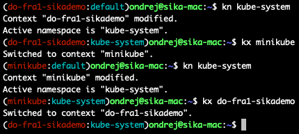
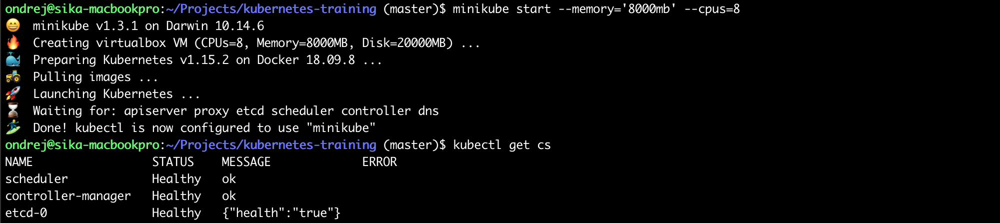

[Ondrej Sika (sika.io)](https://sika.io) | <ondrej@sika.io> | [go to course ->](#course) | [install kubernetes ->](#install-kubernetes)


# Kubernetes Training

    Ondrej Sika <ondrej@ondrejsika.com>
    https://github.com/ondrejsika/kubernetes-training

Source of my Kubernetes Training.

## About Course

- [Kubernetes training in Czech Republic](https://ondrej-sika.cz/skoleni/kubernetes?_s=gh-kte)
- [Kubernetes training in Europe](https://ondrej-sika.com/training/kubernetes?_s=gh-kte)

### Related Courses

- Bare Metal Kubernetes - [ondrejsika/bare-metal-kubernetes](https://github.com/ondrejsika/bare-metal-kubernetes) (on Github)

### Slides

<https://sika.link/k8s-slides>

## 12 Factor Apps

[12factor.net](https://12factor.net)

Set of 12 rules how to write modern applications.

### Any Questions?

Write me mail to <ondrej@sika.io>

<!-- BEGIN Install -->

## Install Kubernetes

You have to install these tools:

- **kubectl** - Kubernetes client [official instructions](https://kubernetes.io/docs/tasks/tools/install-kubectl/)
- **helm** - Package manager for Kubernetes [official instructions](https://github.com/helm/helm/blob/master/docs/install.md)
- **minikube** - Tool for local setup of Kubernetes cluster [official instructions](https://kubernetes.io/docs/tasks/tools/install-minikube/#install-minikube), may require **VirtualBox**

### Mac

#### Kubectl on Mac

```
brew install kubernetes-cli
```

If it doesn't work correctly (for instance you have Docker installed) you need to point kubectl to the right binary.

```
rm /usr/local/bin/kubectl
brew link --overwrite kubernetes-cli
```

Or upgrade

```
brew upgrade kubernetes-cli
```

#### Helm on Mac

```
brew install kubernetes-helm
```

Or upgrade

```
brew upgrade kubernetes-helm
```

#### Minikube on Mac

```
brew install minikube
```

Or upgrade

```
brew upgrade minikube
```

If you dont have VirtualBox, you can install it using Brew.

```
brew cask install virtualbox
```

### Linux

#### Kubectl on Linux

```
curl -LO https://storage.googleapis.com/kubernetes-release/release/$(curl -s https://storage.googleapis.com/kubernetes-release/release/stable.txt)/bin/linux/amd64/kubectl && chmod +x ./kubectl && sudo mv ./kubectl /usr/local/bin/kubectl
```

#### Helm on Linux

Docs <https://github.com/helm/helm/blob/master/docs/install.md>

Install using snap:

```
sudo snap install helm --classic
```

Or oneliner for Linux:

```
curl https://raw.githubusercontent.com/helm/helm/master/scripts/get | bash
```

#### Minikube on Linux (Linux on host)

Also requires [Virtual Box](https://www.virtualbox.org/wiki/Downloads)

```
curl -Lo minikube https://storage.googleapis.com/minikube/releases/latest/minikube-linux-amd64 && chmod +x minikube && sudo cp minikube /usr/local/bin/ && rm minikube
```

#### Minikube on Linux (Linux in virtual machine)

If you want run Kubernetes inside of custom virtual machine, you can also use **minikube** with VM Driver none.

```
curl -Lo minikube https://storage.googleapis.com/minikube/releases/latest/minikube-linux-amd64 && chmod +x minikube && sudo cp minikube /usr/local/bin/ && rm minikube
```

You can start Kubernetes cluster using

```
minikube start --vm-driver=none
```

#### Microk8s.io on Linux (Linux in virtual machine)

If you run Ubuntu (or another linux with **snap**), you can use [microk8s.io](https://microk8s.io)

```
sudo snap install microk8s --classic
```

See more information at <https://microk8s.io/docs/>

#### k3s (minimalistic kubernetes for Linux)

If you can't run **minikube** (with VirtualBox or VM driver none) or **microk8s**, you can try **k3s**.

See more on <https://k3s.io/>

### Windows

#### Kubectl for Windows

```
choco install kubernetes-cli
```

#### Helm for Windows

```
choco install kubernetes-helm
```

#### Minikube for Windows

```
choco install minikube
```

### Bash Completion

```
source <(kubectl completion bash)
source <(minikube completion bash)
source <(helm completion bash)
```

Or save to `.bashrc`

```
echo "source <(kubectl completion bash)" >> ~/.bashrc
echo "source <(minikube completion bash)" >> ~/.bashrc
echo "source <(helm completion bash)" >> ~/.bashrc
```

Also work for zsh, eg.: `source <(kubectl completion zsh)`

<!-- END Install -->

### Kube PS1

[jonmosco/kube-ps1](https://github.com/jonmosco/kube-ps1)

#### Install

```
brew install kube-ps1
```

Add to `.bashrc`:

```
function kps1() {
  source "/usr/local/opt/kube-ps1/share/kube-ps1.sh"
  export KUBE_PS1_SYMBOL_ENABLE=false
  export PS1='$(kube_ps1)'$PS1
}
```

See my [bashrc](https://github.com/ondrejsika/dotfiles/blob/master/core/bashrc#L99)

Activate using:

```
kps1
```


### kubectx & kubens

[ahmetb/kubectx](https://github.com/ahmetb/kubectx)

#### Install

```
brew install kubectx
```

Add aliases to `.bashrc`:

```bash
# kubectl
alias k=kubectl
complete -F _complete_alias k

# kubectx
alias kx=kubectx
complete -F _complete_alias kx

# kubens
alias kn=kubens
complete -F _complete_alias kn
```

See my [bashrc](https://github.com/ondrejsika/dotfiles/blob/master/core/bashrc#L87)



### Start Minikube

```
minikube start
```

Run with Hyper-V (on Windows) - <https://medium.com/@JockDaRock/minikube-on-windows-10-with-hyper-v-6ef0f4dc158c>

```
minikube start --vm-driver hyperv --hyperv-virtual-switch "Primary Virtual Switch"
```

Verify cluster health by

```
kubectl get cs
```

If you see something like this



Your cluster is up and running. Good job!

### Connect My Demo Cluster

I recommend you using Minikube (or Kubernetes support in Docker Desktop), but if you can't run any of those local kubernetes clusters, you can connect to my Kubernetes cluster on Digital Ocean.

Download & use my Digital Ocean Kubernetes confing (repository [ondrejsika/kubeconfig-sikademo](https://github.com/ondrejsika/kubeconfig-sikademo/)). This Kubernetes cluster is created by [ondrejsika/terraform-do-kubernetes-example](https://github.com/ondrejsika/terraform-do-kubernetes-example) on Digital Ocean.

```
wget https://raw.githubusercontent.com/ondrejsika/kubeconfig-sikademo/master/kubeconfig
```

Set `KUBECONFIG` environment variable to this file.

On Unix:

```
export KUBECONFIG=kubeconfig
```

On Windows (in PowerShell):

```
Set-Variable -Name "KUBECONFIG" -Value "kubeconfig"
```

On Windows (in CMD):

```
SET KUBECONFIG=kubeconfig
```

Or save it to `.kube/config`:

```
mv kubeconfig ~/.kube/config
```

Create own namespace (eg.: `ondrejsika`) and set it as default

```
kubectl create ns ondrejsika
kubectl config set-context do-fra1-sikademo --namespace=ondrejsika
```

Sources:

- Set Default Namespace - <https://stuff.21zoo.com/posts/kubectl-set-default-namespace/>

## Course

### Check Cluster Status

Validate cluster health after setup

```
kubectl get cs
```

### Explain Kubernetes Resources

```
kubectl explain node
kubectl explain node.spec

kubectl explain pod
kubectl explain pod.spec
```

### Get Nodes

```
kubectl get nodes
```

### Proxy to cluster

Start proxy

```
kubectl proxy
```

### Dashboard

#### Minikube

```
minikube addons enable dashboard
```

See the dashboard: <http://127.0.0.1:8001/api/v1/namespaces/kube-system/services/http:kubernetes-dashboard:/proxy/>

or just:

```
minikube dashboard
```

Which start a new proxy, activate the dashboard and open it in the browser.

### Production cluster (AWS, RKE, Digital Ocean)

Source of Kubernetes Dashboard - https://github.com/kubernetes/dashboard

```
kubectl apply -f https://raw.githubusercontent.com/kubernetes/dashboard/v2.0.4/aio/deploy/recommended.yaml
```

See the dashboard: http://127.0.0.1:8001/api/v1/namespaces/kubernetes-dashboard/services/https:kubernetes-dashboard:/proxy/

**DON'T RUN ON PRODUCTION**: If you want to grant permissions to dashboard without need for a token, you can run this:

Add `cluster-admin` role to dashboard user:

```
kubectl apply -f kubernetes-dashboard-cluster-admin.yml
```

and:

```
kubectl patch deployment \
  kubernetes-dashboard \
  --namespace kubernetes-dashboard \
  --type='json' \
  --patch='[{"op": "replace", "path": "/spec/template/spec/containers/0/args", "value": [
  "--auto-generate-certificates",
  "--enable-insecure-login",
  "--enable-skip-login",
  "--namespace=kubernetes-dashboard"
]}]'
```

Sources:

- https://devblogs.microsoft.com/premier-developer/bypassing-authentication-for-the-local-kubernetes-cluster-dashboard/
- https://stackoverflow.com/a/62039375/5281724

### K9s - CLI Dashboard

- https://k9scli.io/
- https://github.com/derailed/k9s

### Create Pod

```
kubectl apply -f 01_pod.yml
kubectl apply -f 02_pod.yml
```

### List Pods

```
kubectl get pods
kubectl get po
```

See:

- http://127.0.0.1:8001/api/v1/namespaces/default/pods/simple-hello-world/proxy/
- http://127.0.0.1:8001/api/v1/namespaces/default/pods/multi-container-pod/proxy/

or using port forward:

```
kubectl port-forward pod/simple-hello-world 8000:80
```

See: <http://127.0.0.1:8000>

Get Pod from file:

```
kubectl get -f 01_pod.yml
kubectl get -f 02_pod.yml
```

### Describe Pod

See informations & events in pretty output

```
kubectl describe -f 01_pod.yml
kubectl describe -f 02_pod.yml
```

### Exec (Connect) Pod

```
kubectl exec -ti multi-container-pod -- bash
```

Connect specific container

```
kubectl exec -ti multi-container-pod -c date -- bash
```

### Pod Logs

```
kubectl logs simple-hello-world
```

or following logs

```
kubectl logs simple-hello-world -f
```

Logs from multi container pod

```
kubectl logs multi-container-pod nginx
kubectl logs multi-container-pod date
```

### Assigning Pods to Nodes

Docs - <https://kubernetes.io/docs/concepts/configuration/assign-pod-node/>

#### See node labels

```
kubectl get nodes --show-labels
```

#### Create new labels

You can create own labels

```
kubectl label nodes <node-name> <label-key>=<label-value>
```

Example

```
kubectl label nodes minikube node=primary
```

### Select by node name (nodeName)

```
kubectl apply -f nodename.yml
```

### Select by label (nodeSelector)

```
kubectl apply -f nodeselector.yml
```

### Affinity

<https://kubernetes.io/docs/concepts/configuration/assign-pod-node/#affinity-and-anti-affinity>

#### requiredDuringSchedulingIgnoredDuringExecution

```
kubectl apply -f affinity_required.yml
```

#### preferredDuringSchedulingIgnoredDuringExecution

```
kubectl apply -f affinity_preferred.yml
```

### Delete Pod

```
kubectl delete -f 01_pod.yml -f 02_pod.yml

# or
kubectl delete po/simple-hello-world
kubectl delete po/multi-container-pod
```

### Delete All Pods

```
kubectl delete po --all
```

### Private Container Registry

Deploy private pod

```
kubectl apply -f private_pod.yml
```

See <http://127.0.0.1:8001/api/v1/namespaces/default/pods/private-pod/proxy/>

See credentials (of example `registry.sikahq.com`)

```
echo $(kubectl get secret private-registry-credentials -o jsonpath="{.data.\.dockerconfigjson}" | base64 --decode | jq '.auths["registry.sikahq.com"].auth' -r | base64 --decode)
```

Cleanup

```
kubectl delete -f private_pod.yml
```

### Service

Create service which point to your ReplicaSets, Deployments and DaemonSets.

We will talk about services later.

```
kubectl apply -f service.yml
```

See proxy to service: <http://127.0.0.1:8001/api/v1/namespaces/default/services/example/proxy/>

Try apply pods:

```
kubectl apply -f 01_pod.yml -f 02_pod.yml -f private_pod.yml
```

Check service proxt again. <http://127.0.0.1:8001/api/v1/namespaces/default/services/example/proxy/>

Delete pods

```
kubectl delete -f 01_pod.yml -f 02_pod.yml -f private_pod.yml
```

### Create Replica Set

```
kubectl apply -f 03_01_replica_set.yml
```

### List Replica Sets

```
kubectl get replicasets
kubectl get rs
kubectl get rs,po
```

See pods in service proxy: <http://127.0.0.1:8001/api/v1/namespaces/default/services/example/proxy/>

or using port forward:

```
kubectl port-forward rs/hello-world-rs 8000:80
```

See: <http://127.0.0.1:8000>

### Update Replica Set

See the difference

```
vimdiff 03_01_replica_set.yml 03_02_replica_set.yml
```

```
kubectl apply -f 03_02_replica_set.yml
```

### Delete Replica Set

```
kubectl delete -f 03_01_replica_set.yml

# or
kubectl delete rs/hello-world-rs
```

### Create Deployment

```
kubectl apply -f 04_01_deployment.yml
```

You can wait until Deployment (DaemonSet, StatefulSet) will be rolled out

```
kubectl rollout status deployment hello-world
```

### List Deployments

```
kubectl get deployments
kubectl get deploy
kubectl get deploy,rs,po
```

See pods in service proxy: <http://127.0.0.1:8001/api/v1/namespaces/default/services/example/proxy/>

or using port forward:

```
kubectl port-forward deploy/hello-world 8000:80
```

See: <http://127.0.0.1:8000>

### Update Deployment

See the difference

```
vimdiff 04_01_deployment.yml 04_02_deployment.yml
```

```
kubectl apply -f 04_02_deployment.yml
```

### History of deployments

Deploy nginx & apache for longer history

```
kubectl apply -f 04_03_deployment.yml
kubectl rollout status deployment hello-world
kubectl apply -f 04_04_deployment.yml
kubectl rollout status deployment hello-world
```

See the history

```
kubectl rollout history deploy hello-world
```

### Rollback (Rollout)

One version back

```
kubectl rollout undo deploy hello-world
```

To specific revision

```
kubectl rollout undo deploy hello-world --to-revision=2
```

### Clean up Policy

https://kubernetes.io/docs/concepts/workloads/controllers/deployment/#clean-up-policy

### Delete Deployment

```
kubectl delete -f 04_01_deployment.yml

# or
kubectl delete deploy/hello-world
```

### Create StatefulSet

```
kubectl apply -f statefulset.yml
kubectl rollout status sts hello-world
```

### List StatefulSets

```
kubectl get sts
kubectl get sts,po
```

See pods in service proxy: <http://127.0.0.1:8001/api/v1/namespaces/default/services/hello-world/proxy/>

### Update StatefulSet

See the difference

```
vimdiff statefulset.yml statefulset2.yml
```

Upgrade statefull set

```
kubectl apply -f statefulset2.yml
```

### Headless Service

Service which expose pods on `<pod-name>.<svc-name>` (`<pod-name>.<svc-name>.<namespace>.svc.cluster.local`). Requires `spec.clusterIP: None`.

See service in Stateful Set.

Example:

```
kubectl run example -ti --rm --image=nixery.dev/shell/curl/host bash
```

And try (inside of Kubernetes):

```
host hello-world
host hello-world-0.hello-world
host hello-world-1.hello-world

curl hello-world
curl hello-world
curl hello-world-0.hello-world
curl hello-world-1.hello-world
```


### Delete StatefulSet

```
kubectl delete -f statefulset.yml

# or
kubectl delete sts/hello-world
```

### Create DaemonSet

```
kubectl apply -f daemonset.yml
kubectl rollout status ds hello-world
```

### List DaemonSets

```
kubectl get ds
kubectl get ds,po
```

See pods in service proxy: <http://127.0.0.1:8001/api/v1/namespaces/default/services/example/proxy/>

### Update DaemonSet

See the difference

```
vimdiff daemonset.yml daemonset2.yml
```

Upgrade daemonset set

```
kubectl apply -f daemonset2.yml
```

### Delete DaemonSet

```
kubectl delete -f daemonset.yml

# or
kubectl delete ds/hello-world
```

### Create Job

- <https://kubernetes.io/docs/concepts/workloads/controllers/jobs-run-to-completion/>
- <https://eksworkshop.com/batch/jobs/>

Create job:

```
kubectl apply -f job.yml
```

Create parallel job:

```
kubectl apply -f parallel_jobs.yml
```

### Create Cron Job

- <https://kubernetes.io/docs/tasks/job/automated-tasks-with-cron-jobs/>

```
kubectl apply -f cronjob.yml
```

### Delete Jobs

```
kubectl delete -f job.yml -f parallel_jobs.yml -f cronjob.yml
```

### kubectl run

Create deployment from command line

```
kubectl run bash -it --rm --image=nixery.dev/shell/curl/host -- bash
```

Cleanup is not necessary, because `--rm` parameter deletes deployment after container exits.

### Create Service ClusterIP

Create deploymnet again:

```
kubectl apply -f 04_02_deployment.yml
```

And create service:

```
kubectl apply -f 05_clusterip_service.yml
```

See: http://127.0.0.1:8001/api/v1/namespaces/default/services/hello-world-clusterip/proxy/

### Create Service NodePort

```
kubectl apply -f 06_nodeport_service.yml
```

See: http://127.0.0.1:8001/api/v1/namespaces/default/services/hello-world-nodeport/proxy/

You can also open NodePort directly using:

```
minikube service hello-world-nodeport
```

or see url:

```
minikube service hello-world-nodeport --url
```

### Create LoadBalancer Service (Public Cloud only)

```
kubectl apply -f loadbalancer.yml
```

Wait until get external IP address. Works only in public clouds (like Digital Ocean, AWS) NOT in minikube.

### List Services

```
kubectl get services
kubectl get svc
kubectl get po,rs,deploy,svc
kubectl get all
```

### Delete Service

```
kubectl delete -f 05_clusterip_service.yml
kubectl delete -f 06_nodeport_service.yml

# or
kubectl delete svc/hello-world-nodeport
kubectl delete svc/hello-world-clusterip

# and deployment
kubectl delete deploy/hello-world
```

## Ingress

### Enable Ingress on Minikube

```
minikube addons enable ingress
```

### Traefik Ingress Controller

See [ondrejsika/kubernetes-ingress-traefik](https://github.com/ondrejsika/kubernetes-ingress-traefik)

Install Traefik Ingress Controller:

```
kubectl apply -f https://raw.githubusercontent.com/ondrejsika/kubernetes-ingress-traefik/master/ingress-traefik.yml
```

### Create Ingress

Create some services (& deploymnets)

```
kubectl apply -f webservers.yml
```

See:

- http://127.0.0.1:8001/api/v1/namespaces/default/services/nginx/proxy/
- http://127.0.0.1:8001/api/v1/namespaces/default/services/apache/proxy/

Create Ingress

```
kubectl apply -f ingress.yml
```

See:

- http://nginx.192.168.99.100.nip.io
- http://apache.192.168.99.100.nip.io

Cleanup

```
kubectl delete -f webservers.yml -f ingress.yml
```

### Deploy Application (Multiple Deployments and Services)

```
kubectl apply -f 07_counter.yml
```

See: http://127.0.0.1:8001/api/v1/namespaces/default/services/counter/proxy/

### List components

```
kubectl get all -l project=counter
```

### Open in Browser

```
minikube service counter
```

### Delete Application

```
kubectl delete -f 07_counter.yml
```

## InitContainers

More about init containers here: <https://kubernetes.io/docs/concepts/workloads/pods/init-containers/>

See example [init_containers.yml](init_containers.yml)

See also diff with counter example

```
vimdiff 07_counter.yml init_containers.yml
```

Example:

```
kubectl apply -f init_containers.yml

kubectl get -f init_containers.yml

minikube service counter

kubectl delete -f init_containers.yml
```

See example of [ondrejsika/wait-for-it](https://github.com/ondrejsika/docker-training/tree/master/examples/wait-for-it)

#### Setup some env example using Init Containers

```
kubect apply -f init_containers_setup.yml
```

### Create Namespace

```
kubectl create namespace counter
```

or

```
kubectl apply -f 08_namespace.yml
```

### List Namespaces

```
kubectl get namespaces
kubectl get ns
```

### Get Resources from All Namespaces

Try

```
kubectl get pods

# and

kubectl get pods -A
kubectl get pods --all-namespaces
```

### Deploy to Namespace

```
kubectl apply -f 07_counter.yml -n counter
```

See: http://127.0.0.1:8001/api/v1/namespaces/counter/services/counter/proxy/

### Switch Namespace in Current Context

```
kubectl config set-context $(kubectl config current-context) --namespace=counter
```

### Delete Namespace

```
kubectl delete -f 08_namespace.yml

# or
kubectl delete ns/counter
```

### Resource Quotas

Create Resource Quotas

```
kubectl apply -f resourcequota.yml
```

See Resource Quotas:

```
kubectl describe resourcequotas
```

Try to deploy:

```
kubectl apply -f statefulset.yml
kubectl apply -f service.yml
kubectl apply -f 01_pod.yml
```

### Wordpress Example

Start

```
kubectl create namespace wp
kubectl -n wp apply -f 09_wordpress.yml
```

See: http://127.0.0.1:8001/api/v1/namespaces/wp/services/wordpress/proxy/

Open

```
minikube -n wp service wordpress
```

Stop & delete

```
kubectl delete namespace wp
```

## Storage & Volumes

### EmptyDir

Docs: <https://kubernetes.io/docs/concepts/storage/volumes/#emptydir>

#### Stored on disk

```
kubectl apply -f emptydir.yml
```

Empty dir volemes are stored in `/var/lib/kubelet/pods/<pod uid>/volumes/kubernetes.io~empty-dir`

See volumes on node:

```
tree /var/lib/kubelet/pods/$(kubectl get pods/emptydir -o jsonpath='{.metadata.uid}')/volumes/kubernetes.io~empty-dir/
```

#### Stored in memory (ramdisk)

```
kubectl apply -f emptydir_memory.yml
```

If you use in memory volumes, files stored there counts into container's memory limit.

## PersistentVolume & PersistentVolumeClaim

### PersistentVolumeClaim

From default **StorageClass** (`kubectl get storageclass` or `kubectl get sc`)

```
kubectl apply -f pvc_default.yml
```

See PV and PVC

```
kubectl get pv,pvc
```

Delete claim & volume

```
kubectl delete -f pvc_default.yml
kubectl get pv,pvc
```

### Create PV

For example NFS storage

```
kubectl apply -f pv_nfs.yml
```

See PV

```
kubectl get pv
```

### Claim PV

```
kubectl apply -f pvc_nfs.yml
```

See

```
kubectl get pv,pvc
```

Use PVC

```
kubectl apply -f pvc_mount_example.yml
```

See: <http://127.0.0.1:8001/api/v1/namespaces/default/services/nginx/proxy/>

Clean up

```
kubectl delete -f pv_nfs.yml -f pvc_nfs.yml -f pvc_mount_example.yml
```

### Longhorn

<https://longhorn.io/>

Install

```
kubectl apply -f https://raw.githubusercontent.com/longhorn/longhorn/v1.1.0/deploy/longhorn.yaml
```

#### Longhorn Dashboard

See <http://127.0.0.1:8001/api/v1/namespaces/longhorn-system/services/longhorn-frontend:80/proxy/>

#### Make Longhorn Default Storage Class

Clean is default from `do-block-storage` (DigitalOcean) and `standard` (Minikube).

```
kubectl patch storageclass do-block-storage -p '{"metadata": {"annotations":{"storageclass.kubernetes.io/is-default-class":"false"}}}'
kubectl patch storageclass standard -p '{"metadata": {"annotations":{"storageclass.kubernetes.io/is-default-class":"false"}}}'
```

Set Longhorn as default

```
kubectl patch storageclass longhorn -p '{"metadata": {"annotations":{"storageclass.kubernetes.io/is-default-class":"true"}}}'
```

### NFS Client Provisioner

Install using Helm:

```
helm install nfs-client-provisioner stable/nfs-client-provisioner --set nfs.server=<nfs-server> --set nfs.path=<exported-path>
```

Example with my NFS server (nfs.sikademo.com):

```
helm install nfs-client-provisioner stable/nfs-client-provisioner --set nfs.server=nfs.sikademo.com --set nfs.path=/nfs
```

You can use `nfs-client` Storage Class:

```
kubectl apply -f pvc_nfs_client.yml
```

## ConfigMaps & Secrets

### Create secret

```
kubectl apply -f 11_secret.yml
```

### Get Values

Base64 encoded

```
echo $(kubectl get secret my-secret -o jsonpath="{.data.password}")
echo $(kubectl get secret my-secret -o jsonpath="{.data.token}")
```

Decoded

```
echo $(kubectl get secret my-secret -o jsonpath="{.data.password}" | base64 --decode)
echo $(kubectl get secret my-secret -o jsonpath="{.data.token}" | base64 --decode)
```

### Create ConfigMap

```
kubectl apply -f 12_config_map.yml
```

### Example usage

```
kubectl apply -f 13_secret_example.yml
```

See <http://127.0.0.1:8001/api/v1/namespaces/default/pods/secret-example/proxy/>

And see the variables:

```
kubectl exec secret-example -- env | grep MY_
```

### EnvFrom

Mount every variables from ConfigMap or Secret. See example:

```
kubectl apply -f configmap_envfrom.yml
kubectl logs envfrom
```

### Config

See / export kubeconfig

```
kubectl config view
```

Parameters

- `--raw` - by default, sensitive data are redacted, see raw config unsing `--raw`
- `--flatten` - embed certificates for portable kubeconfig
- `--minify` - see / export only actual context

Examples

```
kubectl config view --raw
kubectl config view --raw --flatten
kubectl config view --raw --flatten --minify
```

### RBAC

Show all api resources (with verbs)

```
kubectl api-resources -o wide
```

Show all ServiceAccounts:

```
kubectl get sa -A
```

### Command Kubernetes as different service account

```
kubectl get no
```

```
kubectl --as system:serviceaccount:kube-system:default get no
```

```
kubectl --as system:serviceaccount:default:default get no
```

### Can I

```
kubectl auth can-i get po
kubectl auth can-i --as system:anonymous get po
```

### Create cluster admin

```
kubectl apply -f 14_admin.yml
```

### Create kubeconfig for admin

Export actual config

```
kubectl config view --raw --minify > config
```

Use custom Kubernetes config file using environment variable:

Linux & Mac

```bash
export KUBECONFIG=config
```

PowerShell

```powershell
$env:KUBECONFIG = "config"
```

CMD

```cmd
set KUBECONFIG=config
```

Get token:

```
kubectl -n kube-system describe secret $(kubectl -n kube-system get serviceaccounts admin-user -o jsonpath="{.secrets[0].name}")
```

Set token to user:

```
kubectl --kubeconfig=config config set-credentials admin --token=<token>
```

Or get token and create user in config on oneliner:

```
kubectl --kubeconfig=config config set-credentials admin --token=$(kubectl -n kube-system get secret $(kubectl -n kube-system get serviceaccounts admin-user -o jsonpath="{.secrets[0].name}") -o jsonpath="{.data.token}" | base64 --decode)
```

Set new user to context:

```
kubectl --kubeconfig=config config set-context --user=admin --cluster=minikube admin
```

Use new user to context:

```
kubectl --kubeconfig=config config use-context admin
```

And try:

```
kubectl --kubeconfig=config get nodes,svc
```

### Join multiple kubeconfigs

```
cp ~/.kube/config ~/.kube/config.$$(date +%Y-%m-%d_%H-%M-%S).backup
KUBECONFIG=kubeconfig-new.yml:~/.kube/config kubectl config view --raw > /tmp/kubeconfig.merge.yml && cp /tmp/kubeconfig.merge.yml ~/.kube/config
```

### Create pod reader

```
kubectl apply -f 15_read.yml
```

Can I?

```
kubectl auth can-i --as system:serviceaccount:kube-system:read-user get po
```

```
kubectl auth can-i --as system:serviceaccount:kube-system:read-user apply po
```

Add to user to config and change context user

```
kubectl --kubeconfig=config config set-credentials read --token=<token>
# or oneliner
kubectl --kubeconfig=config config set-credentials read --token=$(kubectl -n kube-system get secret $(kubectl -n kube-system get serviceaccounts read-user -o jsonpath="{.secrets[0].name}") -o jsonpath="{.data.token}" | base64 --decode)

kubectl --kubeconfig=config config set-context --user=read --cluster=minikube read
kubectl --kubeconfig=config config use-context read
```

### Create Namespace Admin

```
kubectl apply -f 16_namespace_admin.yml
```

And create user, also with default namespace changed to `devel`

```
kubectl --kubeconfig=config config set-credentials devel --token=<token>
# or oneliner
kubectl --kubeconfig=config config set-credentials devel --token=$(kubectl -n devel get secret $(kubectl -n devel get serviceaccounts devel-user -o jsonpath="{.secrets[0].name}") -o jsonpath="{.data.token}" | base64 --decode)

kubectl --kubeconfig=config config set-context --user=devel --cluster=minikube  --namespace=devel devel
kubectl --kubeconfig=config config use-context devel
```

## Liveness & Readiness Probes

Docs: <https://kubernetes.io/docs/tasks/configure-pod-container/configure-liveness-readiness-probes/>

### Liveness Probe

```
kubectl apply -f probes_liveness.yml
```

Watch pods:

```
watch -n 0.3 kubectl get deploy,rs,po -l app=liveness
```

Watch output:

```
watch -n 0.3 curl -fsSL http://127.0.0.1:8001/api/v1/namespaces/default/services/liveness/proxy/
```

Cleanup

```
kubectl delete -f probes_liveness.yml
```

### Readiness Probe

```
kubectl apply -f probes_readiness.yml
```

Watch pods:

```
watch -n 0.3 kubectl get deploy,rs,po -l app=readiness
```

Watch service:

```
watch -n 0.3 kubectl describe svc readiness
```

Watch output:

```
watch -n 0.3 curl -fsSL http://127.0.0.1:8001/api/v1/namespaces/default/services/readiness/proxy/
```

Cleanup

```
kubectl delete -f probes_readiness.yml
```

## Resource Consumption (`kubectl top`)

We have to have [metric-server](https://github.com/kubernetes-sigs/metrics-server) installed.

Minikube:

```
minikube addons enable metrics-server
```

Direct:

```
kubectl apply -f https://github.com/kubernetes-sigs/metrics-server/releases/download/v0.3.7/components.yaml
```

See nodes comsumptions:

```
kubectl top nodes
```

See pods comsumptions:

```
kubectl top pods
```

```
kubectl top pods -A
```

## Autoscaling (Horizontal Pod Autoscaler)

- <https://kubernetes.io/docs/tasks/run-application/horizontal-pod-autoscale/>
- <https://kubernetes.io/docs/tasks/run-application/horizontal-pod-autoscale-walkthrough/>

We also have to have metrics server enabled

If you requests 200 milli-cores to pod, 50% means that Kubernetes autoscaler keeps it on 100 mili-cores. More info here: [Create Horizontal Pod Autoscaler](https://kubernetes.io/docs/tasks/run-application/horizontal-pod-autoscale-walkthrough/#create-horizontal-pod-autoscaler) and [Algorithm Details](https://kubernetes.io/docs/tasks/run-application/horizontal-pod-autoscale/#algorithm-details).

### Create HPA (command)

Create deployment & service

```
kubectl apply -f 04_01_deployment.yml
```

Autoscale

```
kubectl autoscale deployment hello-world --min=2 --max=5 --cpu-percent=80
```

### Create HPA (YAML)

Api v1 (same as `kubectl autoscale`)

```
kubectl apply -f hpa_v1.yml
```

Run AB locally:

```
ab -c 4 -n 100000 $(minikube service hpav1-web --url)/
```

or from Kubernetes

```
kubectl run ab --image=ondrejsika/ab --rm -ti -- ab -c 4 -n 100000 http://hpav1-web/
```

See autoscaling at work

```
watch -n 0.3 -d kubectl get -f hpa_v1.yml
```

Api v2

```
kubectl apply -f hpa.yml
```

### Get HPAs

```
kubectl get hpa
```

### Test Autoscaling

Run AB locally

```
ab -c 4 -n 100000 $(minikube service apache --url)/
```

or in Kubernetes:

```
kubectl run ab --image=ondrejsika/ab --rm -ti -- ab -c 4 -n 100000 http://apache/
```

And see

```
kubectl get hpa,po
```

### Delete HPA

```
kubectl delete -f hpa.yml
```

and clean up

```
kubectl delete hpa/hello-world
kubectl delete -f 04_01_deployment.yml
```

## Deployment Strategies

Great resources by Container Solutions

- [article](https://container-solutions.com/kubernetes-deployment-strategies)
- [repository](https://github.com/ContainerSolutions/k8s-deployment-strategies)

### Ramped (without downtime)

Create deployment & service

```
kubectl apply -f strategy_ramped.yml
```

See update

```
vimdiff strategy_ramped.yml strategy_ramped_2.yml
```

Update without downtime

```
kubectl apply -f strategy_ramped_2.yml
```

Clean up

```
kubectl delete -f strategy_ramped.yml
```

### Recreate

Create deployment & service

```
kubectl apply -f strategy_recreate.yml
```

See update

```
vimdiff strategy_recreate.yml strategy_recreate_2.yml
```

Update with downtime

```
kubectl apply -f strategy_recreate_2.yml
```

Clean up

```
kubectl delete -f strategy_recreate.yml
```

## Helm

Tillerless (Helm 3) is out, check out quick overview (CS) on my blog: <https://ondrej-sika.cz/blog/helm3/>

### Initialize Stable Charts Repository

```
helm repo add stable https://charts.helm.sh/stable
```

Source of all stable charts are in this repository: <https://github.com/helm/charts>

If you want update charts info, call update:

```
helm repo update
```

### Search Package

Search Helm Hub ([hub.helm.sh](https://hub.helm.sh/))

```
helm search hub db
```

Search local repositories

```
helm search repo redis
```

### Inspect Package

```
helm show chart stable/redis
helm show values stable/redis
helm show readme stable/redis

helm show all stable/redis
```

### Install Package

```
helm install <deployment_name> <chart>
```

Example:

```
helm install redis stable/redis
```

Or dry run (see the Kubernetes config)

```
helm install redis stable/redis --dry-run
```

### Upgrade Package

If you want to upgrade instance of chart, you have to call:

```
helm upgrade redis stable/redis --set pullPolicy=Always
```

### Install or Upgrade

You can add `--install` to `helm upgrade` to install package if not exists. When chart exists, it will be upgraded.

```
helm upgrade --install redis stable/redis --set pullPolicy=Always
```

### List Installed Packages

```
helm ls
helm ls -q
```

### Status of Package

```
helm status redis
```

### Delete Package

```
helm uninstall redis
```

Delete all & purge

```
helm uninstall $(helm ls -a -q)
```

### Helm Repositiories

#### List repositories

```
helm repo list
```

#### Add repository

```
helm repo add ondrejsika https://helm.oxs.cz

helm search repo ondrejsika
```

#### Install ondrejsika/one-image

Sources of Chart `ondrejsika/one-image` are <https://github.com/ondrejsika/one-image-helm>

Inspect Package

```
helm show all ondrejsika/one-image
```

Install with values in args

```
helm install hello-world ondrejsika/one-image --set host=hello-world.192.168.99.100.nip.io
```

Install with values file

```
helm install nginx ondrejsika/one-image --values one-image-nginx-values.yml
helm install apache ondrejsika/one-image --values one-image-apache-values.yml
```

Install with values file and values args

```
helm install nginx2 ondrejsika/one-image --values one-image-nginx-values.yml --set host=nginx2.192.168.99.100.nip.io
```

### Own Helm Package

You can init package using

```
helm create counter
```

See what's inside

```
cd counter
tree
```

This default manifests are too much complicated, if you want simple examle, check out my [ondrejsika/one-image-helm](https://github.com/ondrejsika/one-image-helm).

We can try create helm package for our Wordpress example (09_wordpress.yml).

We have to replace few names & labes with `{{ .Release.Name }}` to allow multiple deployments (installations) of chart. For labels, I use `release: {{ .Release.Name }}`, it works, it's simple and make sense.

I also replace all variable part with values like `image: {{ .Values.image }}`, which I can overwrite.

See example (`one-image/deployment.yaml`)

```yaml
apiVersion: apps/v1
kind: Deployment
metadata:
  name: {{ .Release.Name }}
  {{ if .Values.changeCause }}
  annotations:
    kubernetes.io/change-cause: {{ .Values.changeCause }}
  {{ end }}
  labels:
    release: {{ .Release.Name }}
spec:
  replicas: 1
  selector:
    matchLabels:
      release: {{ .Release.Name }}
  template:
    metadata:
      labels:
        release: {{ .Release.Name }}
    spec:
      containers:
        - name: {{ .Chart.Name }}
          image: {{ .Values.image }}
          ports:
            - name: http
              containerPort: 80
              protocol: TCP
```

You can also split your components to own files, it will be easier to read.

If you're lazy, you can just use `helm-counter.yaml`.

Just remove everything in templates dir & copy there that prepared file.

```
rm -rf templates/*
cp ../helm-counter.yaml templates/counter.yml
```

#### See Template

```
helm template counter .
helm template counter . --set host=counter.192.168.99.100.nip.io
```

#### Install

```
helm install counter . --set host=counter.192.168.99.100.nip.io
```

#### Build Package

```
cd ..
helm package counter
```

### Create own repository

```
mkdir repo
mv counter-*.tgz repo/
helm repo index repo/
```

Publish it!

```
scp repo/* root@helm.sikademo.com:/helm/
```

#### Use it

Delete previous deployment

```
helm uninstall counter
```

Add repo

```
helm repo add sikademo https://helm.sikademo.com
```

Install package

```
helm install counter sikademo/counter --set host=counter.192.168.99.100.nip.io
```

## Kubernetes Networking

[Docs](https://kubernetes.io/docs/concepts/cluster-administration/networking/)

Plugins:

- Flannel - Simplest network plugin, use encapsulation
- Calico - Support network policy & isolation, use BGP
- Cilium - L7/HTTP Aware network plugin, support network & HTTP policies
- Weave - Mesh routing networking

Resources:

- https://kubernetes.io/docs/concepts/cluster-administration/networking/#how-to-implement-the-kubernetes-networking-model
- https://rancher.com/blog/2019/2019-03-21-comparing-kubernetes-cni-providers-flannel-calico-canal-and-weave/
- https://info.rancher.com/kubernetes-networking-deep-dive

## Network Policy

Deploy webservers:

```
kubectl apply -f webservers.yml
```

Check connection:

```
kubectl run busybox --rm -ti --image=busybox -- wget --spider --timeout=1 nginx
```

Apply policy

```
kubectl apply -f networkpolicy.yml
```

See policy:

```
kubectl get networkpolicies
```

```
kubectl describe -f networkpolicy.yml
```

Check connection again:

```
kubectl run busybox --rm -ti --image=busybox -- wget --spider --timeout=1 nginx
```

Check connection with labels `--labels="access=true"`:

```
kubectl run busybox --rm -ti --image=busybox --labels="access=true" -- wget --spider --timeout=1 nginx
```

## Pod Security Policy

[Docs](https://kubernetes.io/docs/concepts/policy/pod-security-policy/)

A Pod Security Policy is a cluster-level resource that controls security sensitive aspects of the pod specification.

## Minikube with PSP

[Docs](https://minikube.sigs.k8s.io/docs/tutorials/using_psp/)

Setup:

```
mkdir -p ~/.minikube/files/etc/kubernetes/addons
cp minikube-psp.yml ~/.minikube/files/etc/kubernetes/addons/psp.yaml
```

Start Minikube with PSP:

```
minikube start --extra-config=apiserver.enable-admission-plugins=PodSecurityPolicy
```

### Example

Crate NS:

```
kubectl apply -f psp/ns.yml
```

Create PSP:

```
kubectl apply -f psp/psp.yml
```

Create RBAC config:

```
kubectl apply  -f psp/rbac.yml
```

```
kubectl apply --as=system:serviceaccount:psp-example:hacker -f psp/pod.yml
```

Create Root PSP:

```
kubectl apply -f psp/psp-root.yml
```

Create Root RBAC config:

```
kubectl apply  -f psp/rbac-root.yml
```

```
kubectl apply --as=system:serviceaccount:psp-example:root -f psp/pod.yml
```

## Metrics

- Metric Server - Simple in memory metrics server for autoscaling
- Prometheus - Complete metrics pipeline with data persistence

## Prometheus

### Kube Prometheus

[Homepage (Github)](https://github.com/coreos/kube-prometheus)

Prepare Minikube

```
minikube delete
minikube start --kubernetes-version=v1.18.1 --memory=6g --bootstrapper=kubeadm --extra-config=kubelet.authentication-token-webhook=true --extra-config=kubelet.authorization-mode=Webhook --extra-config=scheduler.address=0.0.0.0 --extra-config=controller-manager.address=0.0.0.0
```

Disable Metrics Server

```
minikube addons disable metrics-server
```

Clone `kube-prometheus`:

```
git clone https://github.com/coreos/kube-prometheus
```

Setup:

```
kubectl create -f kube-prometheus/manifests/setup
until kubectl get servicemonitors --all-namespaces ; do date; sleep 1; echo ""; done
kubectl create -f kube-prometheus/manifests/
```

Access Prometheus:

```
kubectl --namespace monitoring port-forward svc/prometheus-k8s 9090
```

See: <http://localhost:9090>

Access Grafana:

```
kubectl --namespace monitoring port-forward svc/grafana 3000
```

Usename: `admin`, password: `admin`

See: <http://localhost:3000>

Access AlertManager:

```
kubectl --namespace monitoring port-forward svc/alertmanager-main 9093
```

See: <http://localhost:9093>

### Custom Metrics

Deploy example app:

```
kubectl apply -f prom/example.yml
```

Start port forward:

```
kubectl port-forward svc/metrics-example 8000:80
```

See:

- <http://127.0.0.1:8000>
- <http://127.0.0.1:8000/metrics>

Apply custom metrics collector:

```
kubectl apply -f prom/sm.yml
```

Check in Prometheus.

Apply custom alerts:

```
kubectl apply -f prom/pr.yml
```

Check in Alert Manager.

### Cleanup Kube Prometheus

Delete custom examples & resources:

```
kubectl delete -f prom/
```

Remove Kube Prometheus:

```
kubectl delete --ignore-not-found=true -f kube-prometheus/manifests/ -f kube-prometheus/manifests/setup
```

## Logging

### Elastic Cloud on Kubernetes

- Intro - <https://www.elastic.co/elastic-cloud-kubernetes>
- Docs / Tutorial - <https://www.elastic.co/guide/en/cloud-on-k8s/current/index.html>
- Github - <https://github.com/elastic/cloud-on-k8s>

### Setup ECK Operator

```
kubectl apply -f https://download.elastic.co/downloads/eck/1.3.0/all-in-one.yaml
```

See logs:

```
kubectl -n elastic-system logs -f statefulset.apps/elastic-operator
```

### Create Elastic Cluster

Setup `logs` namespace:

```
kubectl apply -f eck/ns.yml
```

Create Elasticsearch cluster:

```
kubectl apply -f eck/elasticsearch.yml
```

Wait until `health=green`:

```
kubectl get -f eck/elasticsearch.yml
```

### Run Kibana

```
kubectl apply -f eck/kibana.yml
```

Wait until `health=green`:

```
kubectl get -f eck/kibana.yml
```

### Run Filebeat

```
kubectl apply -f eck/filebeat.yml
```

Wait until start:

```
kubectl get -f eck/filebeat.yml
```

See filebeet logs:

```
kubectl -n logs logs daemonset.apps/filebeat -f
```

### See Logs in Kibana

Get password for user `elastic`:

```
kubectl get -n logs secret logs-es-elastic-user -o=jsonpath='{.data.elastic}' | base64 --decode; echo
```

Run proxy to Kibana:

```
kubectl -n logs port-forward service/logs-kb-http 5601
```

See logs in Kibana:

<https://127.0.0.1:5601/app/logs/stream>

## Links

- Awesome Operators - <https://github.com/operator-framework/awesome-operators>
- Logging - https://kubernetes.io/docs/concepts/cluster-administration/logging/
- Autoscaling based on CPU/Memory - https://blog.powerupcloud.com/autoscaling-based-on-cpu-memory-in-kubernetes-part-ii-fe2e495bddd4
- Kubernetes Cheatsheet - https://kubernetes.io/docs/reference/kubectl/cheatsheet/
- Minikube & Hyper-V - https://medium.com/@JockDaRock/minikube-on-windows-10-with-hyper-v-6ef0f4dc158c
- Deployment Strategies - https://container-solutions.com/kubernetes-deployment-strategies/
- Sticky Sessions - https://medium.com/@zhimin.wen/sticky-sessions-in-kubernetes-56eb0e8f257d
- How To Set Up an Elasticsearch, Fluentd and Kibana (EFK) Logging Stack on Kubernetes - https://www.digitalocean.com/community/tutorials/how-to-set-up-an-elasticsearch-fluentd-and-kibana-efk-logging-stack-on-kubernetes

## Thank you! & Questions?

That's it. Do you have any questions? **Let's go for a beer!**

### Ondrej Sika

- email: <ondrej@sika.io>
- web: <https://sika.io>
- twitter: [@ondrejsika](https://twitter.com/ondrejsika)
- linkedin: [/in/ondrejsika/](https://linkedin.com/in/ondrejsika/)
- Newsletter, Slack, Facebook & Linkedin Groups: <https://join.sika.io>

_Do you like the course? Write me recommendation on Twitter (with handle `@ondrejsika`) and LinkedIn (add me [/in/ondrejsika](https://www.linkedin.com/in/ondrejsika/) and I'll send you request for recommendation). **Thanks**._

Wanna to go for a beer or do some work together? Just [book me](https://book-me.sika.io) :)

## FAQ

### Time Between SIGTERM and SIGKILL (Termination Grace Period)

You can set termination grace period on pod using `terminationGracePeriodSeconds`, default is `10`.

See example usage:

```yaml
apiVersion: v1
kind: Pod
metadata:
  name: example
spec:
  terminationGracePeriodSeconds: 60
  containers:
    - name: simple-hello-world
      image: ondrejsika/go-hello-world:2
```

### Show Node Taints

```
kubectl get nodes -o json | jq .items[].spec.taints
```
